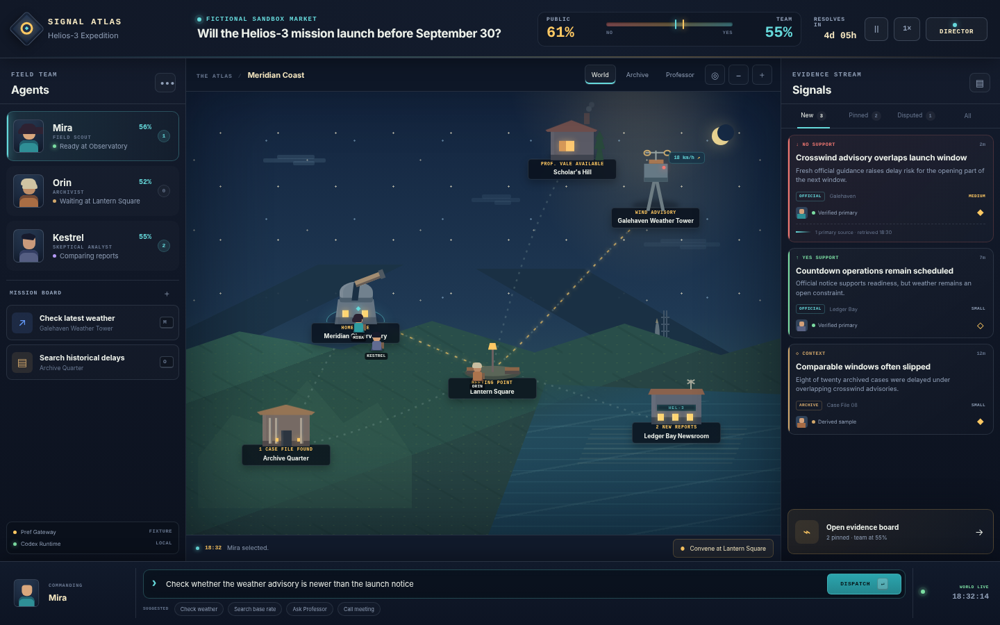
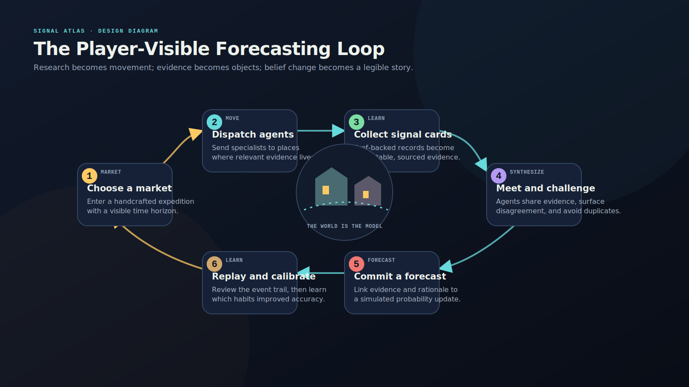
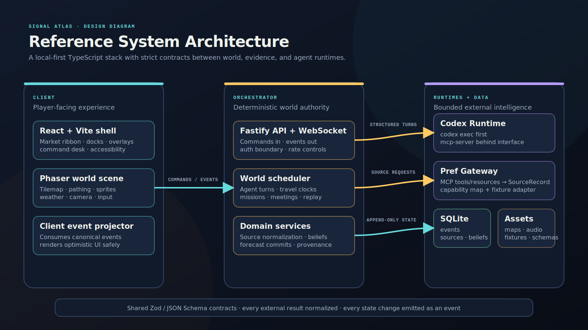

# Signal Atlas Design Bible

**Working title:** Signal Atlas  
**Tagline:** *Walk the world. Gather the signal. Price the future.*

Signal Atlas turns a prediction market into a living two-dimensional pixel world. Markets become explorable semantic geographies; evidence becomes collectible, inspectable signal cards; and local Codex-driven agents become visible field researchers who travel, specialize, meet, disagree, and revise their beliefs.

This document consolidates the product, game, world, agent, information, interface, art, architecture, data, safety, and delivery design. The `codex/` directory is the separate implementation taskbook.



## Document map

1. Executive Summary
2. Product Vision
3. Experience and Game Loop
4. World and Location System
5. Agents and Social System
6. Information, Archive, and Professor
7. UI/UX Specification
8. Art, Audio, and Motion Direction
9. Pref MCP and Codex Architecture
10. Technical Architecture
11. Data Models and Events
12. Trust, Safety, and Accessibility
13. MVP Roadmap and Metrics
14. Open Questions and Decisions
15. Codex Handoff




<div style="page-break-before: always"></div>

## Executive Summary

## The opportunity

Prediction markets are cognitively powerful but visually flat. Most interfaces present a question, a probability chart, order-book details, and a comment stream. The user sees the price, but rarely sees a coherent world model explaining where information is coming from, which evidence is fresh, why participants disagree, or how a forecast evolved.

Signal Atlas converts that invisible research process into a visible game world.

Each market generates a small semantic geography. Places represent where useful evidence lives: a weather station for local conditions, a newsroom for recent reporting, an exchange for market-sensitive data, an archive for historical base rates, a public square for agent-to-agent exchange, and a professor's study for guided synthesis. Agents physically travel between these places. Their actions are driven by local Codex sessions and constrained to a safe, inspectable vocabulary. Pref MCP supplies the underlying information and provenance.

## Product thesis

A strong forecasting experience becomes more compelling when the interface answers five questions continuously:

- Where is each agent, and what are they doing?
- What new evidence entered the world?
- Who has seen it, and who has not?
- Why did a forecast change?
- What remains unknown?

The spatial world is not decoration. It is an interaction model for information asymmetry, research cost, specialization, collaboration, and uncertainty.

## Recommended product shape

Signal Atlas should begin as a local, simulation-first web application rather than a trading terminal. The first goal is to create an irresistible, streamable experience with strong evidence discipline. Live market prices can be displayed, but order placement should remain external and user-confirmed until the product has mature trust, permissions, and compliance boundaries.

The core screen uses a 16:10 editorial-game layout:

- a top market ribbon with question, probability, horizon, and mode;
- a left agent dock with portraits, locations, missions, and status;
- a central pixel world with weather and moving characters;
- a right signal rail containing evidence cards;
- a bottom command tray for direct orders and suggested actions.

The visual identity is "cozy intelligence": warm windows, night-sky blues, parchment evidence cards, animated weather, and tiny expressive agents, paired with crisp modern typography and rigorous provenance UI.

## Technical recommendation

Use a TypeScript monorepo:

- React and Vite for the application shell and information-heavy overlays;
- Phaser for the world scene, tilemaps, camera, animation, and input;
- a Node/Fastify orchestrator with WebSocket events;
- SQLite for local event history, sources, signals, beliefs, and replay;
- Zod/JSON Schema contracts shared across the frontend, orchestrator, and agent runtime;
- a Pref Gateway that normalizes MCP tools/resources into canonical source records;
- a Codex Runtime that either invokes `codex exec` with a final output schema or keeps persistent sessions through `codex mcp-server`.

Agents should be logical actors with persistent IDs and memory, not necessarily one permanently running operating-system process per character. A scheduler resumes a session only when an agent needs a turn. This is cheaper, easier to supervise, and more stable.

## First vertical slice

The first playable slice should use a fictional launch market: "Will the Helios-3 mission launch before September 30?" The world contains Meridian Observatory, Galehaven Weather Tower, Ledger Bay Newsroom, Archive Quarter, and Scholar's Hill. Three agents investigate weather, historical launch delays, and current operational notices. The player can dispatch them, inspect evidence, arrange a meeting, consult the professor, and commit a forecast.

The vertical slice is successful when a new viewer can understand the product without explanation, issue a meaningful command within one minute, see an agent retrieve a sourced signal, and explain why the team forecast changed.


<div style="page-break-before: always"></div>

## 01. Product Vision

## 1.1 One-sentence concept

Signal Atlas is a living pixel world for prediction markets in which local agents travel to relevant places, gather sourced information through Pref MCP, exchange knowledge, and visibly update their beliefs.

## 1.2 The central design move

Prediction-market research is normally invisible. A user sees a probability, perhaps a chart, and a fragmented discussion. Signal Atlas spatializes the hidden world model behind the forecast.

A place in the game corresponds to a useful class of evidence or interaction. A weather tower represents local observations and forecasts. A newsroom represents recent reports. An archive represents historical documents and base rates. A public square represents social exchange. A professor's study represents deliberate synthesis. Agents move between these locations, so information acquisition and information asymmetry become visible rather than abstract.

The world should feel like a game, but its meaning must remain legible. Movement is not a random delay. A location tells the player what kind of evidence is being sought, why it matters, and which agent is best suited to retrieve it.

## 1.3 Product promise

The product promises that a user can look at the screen and immediately understand:

- what is being predicted;
- what the current market and team forecasts are;
- where each agent is;
- what each agent is trying to learn;
- which new signals have appeared;
- how reliable and fresh those signals are;
- why the forecast changed;
- what remains unresolved.

## 1.4 Experience pillars

### Evidence has a place

Every major information type has a spatial home. The user learns the world by learning where evidence lives.

### Agents are characters, not chat tabs

Agents have roles, routes, habits, visible status, and interpersonal dynamics. Their dialogue is short and situated. Dense reasoning belongs in inspectable notes, not endless speech bubbles.

### Uncertainty is playable

The game presents uncertainty as a changing world: fog, branching paths, conflicting signal cards, unsettled weather, incomplete archives, and agents who disagree. The objective is not to eliminate uncertainty but to make it intelligible.

### Every belief has provenance

A forecast update should point to the signals that caused it. Every signal should point to source records. The interface must distinguish source fact, extracted claim, agent interpretation, and forecast impact.

### Delight precedes density

The first impression should be a beautiful, animated world. Advanced detail is available on demand. The product should not look like a dashboard wearing a pixel-art background.

### The player remains in control

The player can pause, inspect, redirect, and replay. Live external actions require explicit confirmation. Autonomous behavior is observable and bounded.

## 1.5 Target users

### The curious observer

This user wants to watch a market unfold as a story. They may never issue a complex command. They need obvious motion, expressive agents, simple explanations, and a satisfying resolution sequence.

### The active forecaster

This user wants to direct research, compare evidence, challenge assumptions, and commit a personal or team probability. They need precise source inspection, fast commands, and a strong forecast-history view.

### The research operator

This user treats the game as a visual multi-agent workbench. They need reliable MCP integration, audit logs, source filtering, custom agents, repeatable runs, and exportable evidence packs.

### The host or streamer

This user wants a legible spectacle that an audience can follow. They need theater mode, readable overlays, event callouts, and a clean way to explain disagreements and forecast changes.

## 1.6 Product modes

### Director Mode

The default mode. The player selects agents, assigns missions, pins signals, calls meetings, consults the professor, and commits forecasts.

### Observatory Mode

Agents run mostly autonomously. The player watches and can intervene. The camera follows meaningful events and compresses idle time.

### Analyst Mode

The world remains visible, but the evidence graph, timeline, source metadata, and forecast history receive more screen space. This mode is for serious investigation.

### Replay Mode

The player scrubs through the event log and sees where every agent was, what information each had, and when forecasts changed. Replay is essential for learning and trust.

The MVP should ship Director Mode and a lightweight Observatory toggle. Analyst and Replay modes can follow once event sourcing is stable.

## 1.7 Positioning

Signal Atlas is not merely a skin for a market chart. It is a visual research environment that makes the process of forecasting understandable and entertaining.

It sits at the intersection of:

- prediction-market interfaces;
- cozy management and simulation games;
- multi-agent research systems;
- personal knowledge management;
- live data visualization;
- interactive explainability.

The strongest differentiator is the combination of spatial world modeling, visible information asymmetry, sourced agent behavior, and a playful presentation.

## 1.8 Non-goals for the first release

The first release should not attempt to become:

- a complete exchange or order-book implementation;
- an automatic real-money trading bot;
- an open-ended massively multiplayer world;
- a photorealistic geographic simulator;
- a general social network;
- a universal truth engine;
- a platform with dozens of market types and hundreds of locations.

These directions create operational and design complexity before the core magic is proven.

## 1.9 The ideal first-session story

A new user opens a market and sees a small night-time world. One agent is in the observatory, one is walking toward a weather tower, and one is reading in the archive. The market ribbon says the public price is 61%, while the team's current estimate is 55%.

A weather alert appears over Galehaven. The scout reaches the tower and returns with a sourced signal card. The card supports delay, but its freshness and reliability are clearly shown. The analyst requests a meeting in the town square. The archivist arrives with a historical base-rate card. The agents disagree, briefly debate, and the team estimate moves from 55% to 48%.

The player opens the professor's study, selects both cards, and asks, "Are these signals independent?" The professor explains that both may derive from the same underlying weather system and marks a correlation warning. The player commits 51%, adds a short note, and watches the world's probability lighting settle.

Within a few minutes, the player has experienced discovery, movement, provenance, disagreement, synthesis, and a forecast update without reading a long manual.

## 1.10 Brand direction

**Working name:** Signal Atlas  
**Tagline:** Walk the world. Gather the signal. Price the future.  
**World name:** The Atlas  
**Agents:** Field agents, forecasters, or correspondents  
**Evidence objects:** Signals  
**Forecast actions:** Commit, revise, or hold  
**Historical collections:** Case files  
**Market worlds:** Expeditions

The language should feel intelligent but not corporate. Avoid casino imagery, aggressive trading language, and generic science-fiction jargon. The tone is curious, editorial, warm, and slightly mysterious.


<div style="page-break-before: always"></div>

## 02. Experience and Game Loop

## 2.1 Core loop

The primary loop is:

**Orient -> Dispatch -> Discover -> Cross-check -> Debate -> Commit -> Resolve -> Learn**

### Orient

The player reads the market question, outcomes, resolution rules, time horizon, public market probability, and current team estimate. The game highlights unresolved questions rather than presenting a wall of information.

### Dispatch

The player assigns an agent to a place and selects a mission. A mission is a bounded research objective such as "check local weather warnings," "find historical cases," "look for contradictory reports," or "ask another agent what they know."

### Discover

The agent travels, invokes allowed Pref MCP capabilities, and returns a structured result. The world produces a signal card, a source record, a dialogue line, or an explicit "nothing useful found" event.

### Cross-check

The player or another agent compares signals, searches the archive, traces provenance, and tests whether apparently independent evidence shares the same source.

### Debate

Agents meet in a location and exchange only the information they possess. Their disagreement is represented by concise claims, confidence ranges, and evidence links.

### Commit

The player or team moves the forecast dial. A commit requires a probability, a short public rationale, and at least one linked signal unless the player explicitly chooses "hold with no new evidence."

### Resolve

When the market resolves, the world changes state. The game shows the outcome, the final forecast path, score, key turning points, and which signals were genuinely useful or misleading.

### Learn

The result is stored as a case file. Agents receive visible, bounded calibration updates. The player can replay the expedition and compare alternative decisions.

## 2.2 Session rhythm

A satisfying session alternates between ambient observation and meaningful events.

- **Ambient phase:** agents walk, weather moves, buildings animate, and the market ribbon breathes quietly.
- **Event phase:** a new source arrives, an agent reaches a location, a contradiction is detected, or a forecast changes.
- **Decision phase:** the game asks the player to choose a mission, inspect a signal, convene agents, or commit.
- **Reflection phase:** the world slows while the player reads, compares, or consults.

The interface should never demand constant clicking. A player should be able to enjoy simply watching the world, then intervene at high-value moments.

## 2.3 Time model

The game uses two time layers.

### Real-world time

This is the market's actual horizon: publication times, event deadlines, resolution date, and source freshness.

### Simulation time

This controls animation and pacing. A cross-city trip may take eight seconds on screen even if the real-world location is far away. The semantic cost is represented by mission duration, queueing, and attention rather than literal geography.

The player can pause and use 1x, 2x, and 4x speed. Important events automatically slow or pause according to preferences.

## 2.4 Mission system

A mission has five parts:

- an objective;
- a destination;
- an assigned agent;
- an information budget or timeout;
- a definition of useful output.

Recommended mission verbs:

- Investigate
- Verify
- Search history
- Find contradiction
- Compare sources
- Consult specialist
- Observe local conditions
- Meet agent
- Deliver signal
- Reassess forecast

A mission should be displayed as a small card that can be queued, canceled, or reordered. The agent may propose a follow-up mission, but the player can accept or dismiss it.

## 2.5 Information as game objects

Information enters the world as distinct objects rather than undifferentiated text.

### Source record

The raw retrieved item: document, report, observation, dataset row, market quote, or other Pref result. It has provenance, timestamps, location, content hash, and rights metadata when available.

### Claim

A concise proposition extracted from one or more source records. Claims can support, oppose, or contextualize an outcome.

### Signal card

The playable summary of a claim's relevance to the market. A signal card contains:

- headline;
- directional effect;
- estimated impact range;
- freshness;
- reliability status;
- independence warning;
- source count;
- location;
- who currently knows it;
- links to underlying source records.

### Belief update

A forecast change linked to one or more signal cards. It contains the old probability, new probability, uncertainty range, public rationale, and agent/player identity.

Keeping these objects separate prevents agent interpretation from being mistaken for source fact.

## 2.6 Knowledge asymmetry

Each agent has a knowledge set. An agent knows a signal only after:

- retrieving it;
- receiving it from another agent;
- reading it in the archive;
- being present during a discussion where it is shared.

The player can inspect knowledge distribution through subtle portrait badges and a dedicated "Who knows this?" view. This creates meaningful reasons for movement and meetings.

The game should not hide public information merely to create artificial difficulty. The asymmetry represents workflow and attention, not arbitrary secrecy. The player can always open the global source index in Analyst Mode.

## 2.7 Meetings and debates

When agents meet, the game creates a short structured exchange:

1. Each agent states a current estimate and one key reason.
2. New signals are exchanged.
3. Contradictions and duplicate sources are flagged.
4. Each agent may revise, hold, or request more research.
5. The meeting produces a concise memo.

The scene should last 15-45 seconds and remain skippable. Dialogue is one or two sentences per turn. Detailed notes are available behind the memo.

## 2.8 Forecast mechanic

The forecast control is a large 0-100 dial with three values:

- public market probability;
- team forecast;
- player forecast.

The player can drag the dial or enter a number. A translucent uncertainty band can be added, for example 48-58%. A commit animation should feel consequential but not casino-like: the worldline ribbon shifts, building lights subtly change, and the event log records the update.

For multi-outcome markets, replace the dial with a probability garden: outcome columns whose heights sum to 100%. Multi-outcome support should wait until the binary experience is polished.

## 2.9 Scoring and progression

The MVP should use calibration and research-quality scoring rather than monetary profit.

Recommended scores:

- Brier score or another proper scoring rule for forecast accuracy;
- calibration band performance;
- source discipline, such as percentage of updates with valid provenance;
- contradiction coverage;
- timeliness without rewarding reckless speed;
- diversity of independent evidence.

Progression should unlock cosmetic world elements, agent portraits, archive decorations, map themes, and new analytical tools. Avoid stat upgrades that make forecasts artificially more accurate; agent specialization should change behavior, not secretly improve truth.

## 2.10 Failure states

Failure is informative rather than punitive.

- An agent may return no useful evidence.
- A source may be stale, inaccessible, or contradictory.
- Two signals may collapse into one due to shared provenance.
- A mission may time out.
- A Codex turn may fail schema validation.
- The market may resolve unexpectedly.

Each failure creates a clear world event and a recoverable action. The agent can idle safely, retry once, or ask the player to choose a different mission.

## 2.11 Retention loops

The product can create long-term engagement through:

- daily or weekly expedition boards;
- market seasons grouped by topic;
- agent journals and calibration histories;
- collectible case files;
- world themes and cosmetic customization;
- shared replay links;
- community forecast rooms;
- challenge scenarios using historical markets with hidden outcomes.

Historical challenge scenarios are particularly valuable because they are deterministic, safe, and excellent for onboarding.

## 2.12 MVP content boundary

The first playable slice should contain:

- one binary fictional market;
- one world with six locations;
- three agents;
- eight mission types;
- twelve fixture source records;
- ten signal cards;
- one archive scene;
- one professor scene;
- one meeting sequence;
- forecast commit and resolution replay;
- deterministic save/load.

This is enough to validate the loop without creating a content-production burden.


<div style="page-break-before: always"></div>

## 03. World and Location System

## 3.1 World model

A market world is a semantic map, not a literal atlas. It compresses the places, institutions, actors, and information channels that matter to the question into a navigable two-dimensional space.

Each world contains:

- one central observatory;
- three to eight evidence locations;
- one social location;
- one archive or institutional memory location;
- optional transient locations created by events;
- roads, transit lines, or paths that make movement readable;
- environmental layers such as time of day and weather;
- a world state derived from the market and event log.

## 3.2 Location archetypes

### Observatory

The home base and market overview. It displays the question, outcomes, resolution criteria, forecast history, and mission board. It is the player's first and last stop.

### Newsroom

Provides recent reporting, official announcements, public statements, and local context. It favors fresh information but may surface derivative or duplicated reporting.

### Weather Tower

Provides local weather observations, warnings, and forecasts. It visually reflects current conditions and is ideal for location-bound markets.

### Exchange or Ledger Hall

Provides prices, economic indicators, market-sensitive data, and structured numeric feeds. It should visually feel analytical rather than financial-casino-like.

### Archive Quarter

Stores source records, prior case files, historical analogues, agent memos, and snapshots. It supports search, filtering, provenance tracing, and replay.

### Scholar's Hill

Contains the professor consultation scene. It is a place for synthesis, base-rate reasoning, assumption checks, and explanation.

### Town Square

A social hub where agents meet, trade signals, and debate. A notice board shows unresolved questions and proposed missions.

### Field Site

A temporary or market-specific place such as a port, parliament, factory, stadium, court, laboratory, or launch pad. Field sites make each market world feel distinct.

## 3.3 Topic-to-world templates

The world generator should begin with authored templates rather than fully generative maps.

### Politics and policy

Capital Hall, Polling Bureau, Local Newsroom, Court, Archive, Town Square, Scholar's Hill.

### Weather and climate

Weather Tower, Port, Farm District, Emergency Center, Satellite Station, Archive, Observatory.

### Economics

Central Bank, Exchange, Port, Factory District, Statistics Office, Newsroom, Archive.

### Technology and product launches

Research Lab, Factory, Developer Conference, Patent Office, Supplier Port, Newsroom, Archive.

### Sports and culture

Stadium, Training Ground, Press Box, Fan District, Medical Center, Archive, Town Square.

### Science and space

Launch Site, Mission Control, Weather Tower, Tracking Station, Contractor District, Archive, Observatory.

The generator selects a template, replaces one or two locations with market-specific sites, and assigns information affordances.

## 3.4 Map grammar

Maps should remain small enough to understand at a glance. The recommended first world uses a 48 x 30 logical tile grid, rendered at a 2x or 3x pixel scale.

The layout follows a simple grammar:

- Observatory near the visual center-left;
- freshest-source locations toward the right/top, suggesting outward investigation;
- Archive lower-left, visually stable and warm;
- Scholar's Hill elevated or separated by a bridge;
- Town Square near the center for easy meetings;
- one scenic landmark that identifies the expedition;
- two or three route choices, but no maze-like navigation.

The player should understand routes without a minimap in the first slice.

## 3.5 Movement

Movement is grid- or waypoint-based. Agents follow authored paths between location entrances. A pathfinding system may be added later, but a waypoint graph is more predictable for the vertical slice.

Each route has:

- travel duration;
- visual path;
- ambient events;
- optional transit type;
- interruption policy;
- camera framing hints.

Travel duration should usually be 4-12 seconds. The player can speed up or instantly skip after seeing the route once. The game should not waste the player's time to simulate distance.

## 3.6 Environmental state

The world reflects relevant live or fixture data through restrained environmental changes.

Examples:

- rain intensity near a weather-sensitive location;
- flags or crowds near a government site;
- factory lights indicating operating state;
- a newsroom ticker changing when a source arrives;
- clouds crossing the map as a weather front;
- harbor activity changing with logistics signals;
- the sky gradient shifting as the market horizon approaches.

Environmental state is always decorative or explanatory; it must not imply facts that are absent from source data.

## 3.7 Fog of uncertainty

Use fog as a metaphor for unanswered questions, not as a literal restriction on all information.

A location can have one of four states:

- **Known:** its affordances are visible.
- **Unvisited:** visible but softly desaturated.
- **Active:** an agent or new event is present.
- **Unresolved:** a question badge shows missing evidence.

The map should never conceal resolution rules, market prices, or already-retrieved sources.

## 3.8 Dynamic world events

World events make the map feel alive. Examples include:

- a breaking bulletin appears at the newsroom;
- weather changes at the tower;
- a new shelf opens in the archive;
- an agent requests a meeting;
- a route becomes slower due to an event;
- the professor posts a new question on the chalkboard;
- an evidence location gains or loses relevance;
- a contradiction marker appears between two buildings.

Events come from the deterministic simulation, live Pref data, or player action. Every event is appended to the event log.

## 3.9 World generation pipeline

The recommended pipeline is semi-authored:

1. Parse the market into subject, predicate, outcomes, entities, time horizon, resolution source, and location relevance.
2. Select a topic template.
3. Rank potential place archetypes by evidence value.
4. Choose five to eight locations.
5. Assign each location a visual kit and allowed mission verbs.
6. Build a waypoint graph using an authored layout pattern.
7. Attach Pref capability mappings.
8. Generate unresolved-question badges.
9. Run a validation pass for route connectivity, information coverage, and duplicate functions.
10. Let a human or authoring tool make final visual adjustments.

Fully generative tilemaps are not recommended for the MVP because visual composition is central to the product.

## 3.10 First vertical-slice world

### Market

"Will the Helios-3 mission launch before September 30?"

### Locations

- **Meridian Observatory:** market overview and forecast dial.
- **Galehaven Weather Tower:** local wind, storms, and launch-window conditions.
- **Ledger Bay Newsroom:** operational notices, contractor statements, and recent reports.
- **Archive Quarter:** historical launch delays and prior mission case files.
- **Scholar's Hill:** professor consultation and correlation checks.
- **Lantern Square:** agent meetings and shared mission board.

### Visual landmark

A distant launch vehicle is visible on the horizon. Its gantry lights change subtly as operational signals arrive. This is mood and state visualization, not a direct claim that launch readiness is confirmed.

## 3.11 Authoring tools after MVP

A world editor should eventually allow a designer to:

- place locations and route nodes;
- assign building archetypes;
- bind Pref capabilities;
- set camera zones;
- preview weather and day/night states;
- define ambient event pools;
- validate route connectivity;
- export a versioned world manifest.

The editor can begin as JSON plus a simple debug overlay before becoming a polished visual tool.


<div style="page-break-before: always"></div>

## 04. Agents and Social System

## 4.1 Agent model

An agent is a persistent game character with a role, location, knowledge set, current belief, mission queue, public personality, and a resumable Codex session.

An agent is not identical to an operating-system process. The runtime should treat agents as logical actors and activate a Codex turn only when an action is needed. This allows many visible characters without keeping many expensive processes alive.

## 4.2 MVP agent roster

### Mira - Field Scout

Fast, curious, and freshness-oriented. Mira is best at local observations, breaking reports, and quickly checking a place. She tends to overweight recent information, so she benefits from the archivist's counterbalance.

### Orin - Archivist

Patient and source-conscious. Orin searches case files, tracks provenance, and identifies repeated patterns. He may be slow to react to genuinely novel events.

### Kestrel - Skeptical Analyst

Focused on contradictions, alternative explanations, and probability updates. Kestrel is good at synthesis but should not be allowed to invent evidence. Every forecast rationale must cite known signal IDs.

A fourth role, Liaison, can be added later for larger teams and social coordination.

## 4.3 Agent state

Each agent has:

- stable ID and display name;
- portrait and sprite configuration;
- role and skill tags;
- current place and path progress;
- current mission and queue;
- known source IDs and signal IDs;
- private working notes stored locally;
- public forecast and uncertainty range;
- relationships with other agents;
- fatigue or attention state, if enabled;
- Codex thread/session identifier;
- last successful turn and error state.

Private working notes should never be presented as hidden chain-of-thought. The product stores concise task state, observations, and public rationale only.

## 4.4 Behavioral contract

A Codex-driven agent may choose only from a bounded action vocabulary:

- `move`
- `investigate`
- `query_archive`
- `consult_professor`
- `meet_agent`
- `share_signal`
- `request_mission`
- `update_belief`
- `wait`

Each action is schema-validated. The orchestrator, not the model, decides whether the action is legal in the current world state.

An agent cannot:

- place a real trade;
- execute arbitrary external actions;
- modify another agent's memory directly;
- claim a source it has not retrieved or received;
- create a new world location without an authorized event;
- bypass the Pref Gateway;
- disclose secrets or raw credentials;
- use unrestricted shell/network access for gameplay.

## 4.5 Public personality

Personality should affect style and priorities, not truth access.

A compact personality profile includes:

- sentence rhythm and vocabulary;
- preferred mission types;
- known cognitive tendency;
- social behavior in meetings;
- visual emotes;
- confidence-expression style.

For example, Mira may say, "The tower issued a fresh crosswind notice. I would lower launch odds a little, but this is one update, not a trend." Orin may say, "Three comparable launches waited through similar wind windows. The archive suggests caution, though the sample is small."

The style is distinctive while remaining concise and evidence-linked.

## 4.6 Mission execution flow

1. The scheduler selects an eligible agent turn.
2. The orchestrator assembles a context packet with market state, agent state, destination affordances, known signals, and mission objective.
3. The agent may call read-only Pref tools through the gateway.
4. Codex returns a schema-conforming action result.
5. The orchestrator validates evidence references, permissions, and world legality.
6. Valid results become world events.
7. Invalid results receive one constrained repair attempt.
8. A second failure produces a safe `wait` action and a visible error badge.

## 4.7 Agent-to-agent exchange

Agents exchange explicit objects, not vague summaries. A meeting can transfer:

- signal IDs;
- source IDs;
- unresolved questions;
- forecast estimates;
- mission proposals;
- correlation warnings.

The event log records who shared what, where, and when. This enables replay and true knowledge asymmetry.

## 4.8 Disagreement model

Disagreement has three layers:

### Evidence disagreement

Agents have different sources or interpret source reliability differently.

### Model disagreement

Agents agree on facts but estimate different impact on the outcome.

### Prior disagreement

Agents use different base rates or starting probabilities.

The debate UI labels the type of disagreement. This is more useful than simply showing opposing dialogue.

## 4.9 Trust and relationships

Relationships should be lightweight in the MVP. Each pair of agents can have:

- familiarity;
- recent agreement rate;
- signal-sharing history;
- unresolved challenge count.

Do not implement a hidden "trust stat" that causes one agent to accept another's claims without evidence. Social history can affect which follow-up questions are asked, but provenance remains primary.

## 4.10 Attention and workload

Agents may have one active mission and a short queue. A soft attention meter can explain why they cannot investigate everything simultaneously. It should regenerate quickly and never become a monetization mechanic.

The MVP can omit fatigue entirely and use mission queue length as the only constraint.

## 4.11 Player commands

The player can command agents through direct manipulation or natural language.

Direct manipulation:

- select an agent;
- click a destination;
- choose a mission card;
- confirm or edit the objective.

Natural language examples:

- "Mira, check whether the weather alert is newer than the launch notice."
- "Orin, find three historical delays caused by crosswinds."
- "Kestrel, compare the two strongest delay signals and look for a shared source."
- "Everyone, meet at Lantern Square and reassess."

The command parser converts language into a draft structured mission. The player sees the interpreted command before execution when ambiguity is material.

## 4.12 Autonomous behavior

In Observatory Mode, agents can propose and execute low-risk missions according to policy.

Autonomy levels:

- **Manual:** no mission begins without player approval.
- **Suggest:** agents propose missions; player approves.
- **Bounded auto:** agents execute read-only research missions within budgets.
- **Theater:** agents run continuously, but forecast commits still require configured policy.

The MVP should default to Suggest and support Bounded Auto as an opt-in.

## 4.13 Agent growth

Growth should be transparent and non-mystical. An agent can accumulate:

- a calibration history;
- topic familiarity tags;
- a library of successful mission templates;
- cosmetic journal pages;
- social history.

Do not silently fine-tune behavior based on outcomes in the first release. Any learning mechanism should be inspectable and versioned.


<div style="page-break-before: always"></div>

## 05. Information, Archive, and Professor

## 5.1 Information architecture

Signal Atlas uses a layered evidence model:

1. **Source record:** the retrieved material or observation.
2. **Claim:** a proposition grounded in one or more source records.
3. **Signal:** the claim interpreted for a specific market.
4. **Belief update:** a probability change linked to one or more signals.
5. **Case file:** the complete history of the expedition.

The interface must preserve these boundaries. A source is not automatically a signal, and an agent's interpretation is not automatically a fact.

## 5.2 Pref Gateway

Pref MCP is the primary information channel, but the game should not bind itself directly to unknown tool names or payload shapes. A Pref Gateway discovers available tools/resources and maps them into canonical operations.

Canonical capabilities may include:

- search sources;
- retrieve a source;
- retrieve location conditions;
- retrieve market or event data;
- list archive resources;
- run a topic-specific query;
- subscribe or poll for changes.

The exact mapping is configured per Pref deployment. The game records the original MCP server, tool name, arguments hash, response hash, and retrieval timestamp for auditability.

## 5.3 Source record fields

A source record should contain, when available:

- stable local ID;
- external URI or resource identifier;
- title;
- publisher or origin;
- author;
- publication time;
- observation time;
- retrieval time;
- relevant location;
- media type;
- content hash;
- short excerpt or structured payload;
- source class: primary, official, secondary, commentary, sensor, market, archive;
- rights or display constraints;
- Pref tool/resource provenance;
- version and supersession links.

## 5.4 Signal-card anatomy

A signal card is designed for rapid judgment without hiding nuance.

### Front

- short headline;
- supports YES, supports NO, or context-only indicator;
- estimated impact: small, medium, large, or a numeric range;
- freshness strip;
- reliability badge;
- source count;
- location badge;
- agent portrait showing discoverer;
- independence/correlation warning when relevant.

### Back or expanded view

- exact claim;
- source list;
- publication and retrieval times;
- excerpt or structured facts;
- why the agent believes it matters;
- counterarguments;
- known duplicates;
- who currently knows the signal;
- forecast updates linked to it;
- archive shelf and tags.

## 5.5 Reliability presentation

Avoid a single opaque "truth score." Use interpretable labels:

- **Verified primary:** directly from an official or primary source and validated structurally.
- **Primary, unconfirmed:** direct source but not independently checked.
- **Corroborated secondary:** multiple independent secondary sources.
- **Single secondary:** one report or analysis.
- **Derived:** computed from source data.
- **Rumor or unverified:** explicitly marked and visually muted.
- **Disputed:** credible sources conflict.

The game can compute internal ranking features, but the user-facing UI should show reasons rather than false precision.

## 5.6 Freshness and temporal validity

Every signal has a temporal window. A weather observation can become stale quickly; a historical base rate may remain useful for years. Freshness should therefore be relative to source type and market horizon.

The card's freshness strip shows:

- observed/published time;
- age;
- expected useful lifetime;
- whether a newer version exists.

Stale cards remain in the archive but fade in the active signal rail.

## 5.7 Correlation and duplicate detection

The system should detect when apparently separate signals derive from the same source or event.

Correlation warnings can come from:

- identical or near-identical source URIs;
- shared upstream publisher;
- matching content hashes;
- overlapping excerpts;
- explicit citations;
- same timestamp and event;
- agent or professor analysis.

The UI draws a thread between cards and labels the relationship: duplicate, derivative, same event, or possibly correlated.

## 5.8 Archive experience

The archive is a full-screen or large overlay scene that still feels like a place.

### Spatial metaphor

Shelves represent topics or source classes. A central table holds pinned case files. A rolling ladder moves to the selected date range. Lamps illuminate active filters. The metaphor should remain usable rather than overly literal.

### Functional layout

- left shelf index for markets, topics, locations, and source types;
- central card grid or timeline;
- right inspector for the selected source or signal;
- top search field with natural-language and structured filters;
- bottom case-file tray for selected items.

### Archive content

- raw source records;
- signal cards;
- agent mission reports;
- meeting memos;
- forecast commits;
- prior resolved markets;
- world snapshots;
- exported evidence packs.

## 5.9 Archive interactions

The player can:

- search by phrase, entity, date, place, source class, or agent;
- compare two items side by side;
- trace provenance upstream;
- pin items to the current case file;
- ask an agent to read selected items;
- ask the professor a question about selected items;
- mark an item stale, superseded, disputed, or irrelevant;
- export a cited memo;
- replay the moment an item entered the world.

## 5.10 Professor character

The professor is a diegetic interface for synthesis, not an omniscient oracle.

Working character: **Professor Vale**, a warm but rigorous scholar who writes assumptions on a chalkboard and frequently answers with a question. Vale has access only to the selected items, allowed archive scope, and clearly identified general reasoning tools.

The professor's job is to help the user:

- explain a source or claim;
- compare evidence;
- identify missing assumptions;
- estimate a base rate;
- test independence;
- generate counterarguments;
- propose the next best research question;
- summarize a case file;
- explain a forecast update.

## 5.11 Professor interaction model

The player selects zero or more evidence items, chooses a mode, and enters a question.

Modes:

- Explain
- Challenge
- Compare
- Base rate
- Missing evidence
- Correlation check
- Forecast impact

The response has four visible sections:

1. **Answer:** concise direct response.
2. **Evidence used:** linked signal/source chips.
3. **Assumptions:** explicit and editable.
4. **Next question:** one suggested investigation.

The professor must say when the selected evidence is insufficient.

## 5.12 Professor scene design

The scene is a cozy study on Scholar's Hill. The professor stands near a chalkboard. Selected evidence cards appear as physical notes on a table. As the response arrives, the chalkboard animates a simple structure: facts, assumptions, inference, uncertainty.

The player can expand the response into a conventional reading panel. The scene supplies charm; the panel supplies accessibility and precision.

## 5.13 Evidence-board view

Outside the archive, the player can pin a small set of active signals to an evidence board. Cards can be arranged into:

- YES support;
- NO support;
- context;
- unknowns;
- disputed/correlated clusters.

A forecast update can be initiated from the board, carrying selected evidence into the commit dialog.

## 5.14 Export and portability

A case-file export should include:

- market question and resolution rules;
- forecast timeline;
- selected signals;
- source citations and timestamps;
- agent meeting memos;
- unresolved questions;
- final rationale;
- machine-readable JSON attachment.

The export must distinguish quoted source material, paraphrase, and agent interpretation.


<div style="page-break-before: always"></div>

## 06. UI and UX Specification

## 6.1 Design objective

The interface must make a complex multi-agent research process feel inviting at first glance and rigorous on inspection. The player should experience a world first, then discover that every charming element is attached to a precise information model.

The target visual density is comparable to a polished management game, not a professional trading terminal. Information-heavy panels are progressive overlays that appear only when requested.

## 6.2 Primary desktop layout

The reference canvas is 1440 x 900 in a 16:10 ratio. The experience remains usable down to 1180 x 720. The game world occupies the largest continuous area.

### Top market ribbon: 72 pixels

Contains:

- Signal Atlas mark and expedition name;
- market question, truncated to two lines at most;
- public market probability;
- team forecast and player forecast;
- time to resolution;
- pause and speed controls;
- mode switch: Director or Observatory;
- connection and data-freshness status.

The probability display is a horizontal worldline ribbon rather than a stock-style chart. YES and NO occupy opposite ends; a glowing marker shows current values.

### Left agent dock: 216 pixels, collapsible

Contains agent portrait cards with:

- name and role;
- current location;
- active mission;
- compact progress bar;
- knowledge/new-signal badge;
- current forecast;
- error or attention state.

Selecting an agent opens a focused command card over the world rather than navigating to a new page.

### Central world stage: flexible

Contains the Phaser-rendered map, sprites, location labels, weather, route lines, event callouts, and contextual action menus. Camera motion is slow and intentional. The world stage receives roughly 60-65% of the width at the reference size.

### Right signal rail: 320 pixels, collapsible

Contains the newest and most relevant signal cards. The rail supports tabs:

- New
- Pinned
- Disputed
- All

The top card may be expanded in place. Older cards compress into a compact stack.

### Bottom command tray: 88 pixels, expandable to 260

Contains:

- natural-language command field;
- selected agent chip;
- destination chip;
- suggested action buttons;
- microphone placeholder if voice is added later;
- keyboard shortcut hints;
- mission queue preview.

The tray behaves like an in-world dispatch desk, not a generic chatbot composer.

## 6.3 World-stage interaction

### Hover or focus

A location receives a thin outline, nameplate, current data freshness, and available mission verbs. An agent receives a portrait tooltip with mission and forecast.

### Click or activate

Clicking a location opens a compact action wheel:

- Send selected agent
- Inspect location
- View local signals
- Ask who is here

Clicking an agent opens:

- Current mission
- Known key signals
- Forecast
- Give command
- Follow camera
- Meet with...

### Drag

A selected agent portrait may be dragged onto a location to create a mission draft. The game never immediately executes an ambiguous drag; the player confirms the mission verb.

### Camera

- mouse wheel or trackpad zoom with bounded levels;
- middle-drag or space-drag pan;
- double-click a location to center;
- `F` follows selected agent;
- `Home` returns to Observatory;
- event camera never takes control for more than two seconds without user preference.

## 6.4 Visual hierarchy

The world is the visual anchor. UI panels use lower saturation and flatter lighting so they do not overpower the map.

Hierarchy rules:

1. Critical market changes and errors.
2. New signals and completed missions.
3. Active agents and destinations.
4. Ambient world details.
5. Historical and secondary information.

Only one element should pulse strongly at a time. Avoid simultaneous notification badges, shaking cards, and camera movement.

## 6.5 Screen map

### A. Expedition Lobby

Purpose: choose or create a market world.

Key elements:

- featured expedition card;
- recent and unresolved markets;
- live, historical challenge, and fictional sandbox filters;
- small animated diorama preview;
- source-connection status;
- "Enter Atlas" primary action.

### B. World View

Purpose: observe, command, inspect signals, and update forecasts.

This is the main screen described above.

### C. Archive

Purpose: search and compare sources, signals, memos, and prior cases.

The archive opens as a full-stage scene while the top market ribbon remains. A breadcrumb returns to the world. The player can keep the command tray minimized.

### D. Professor's Study

Purpose: ask a bounded question using selected evidence. The scene includes the professor, chalkboard, evidence table, response panel, and mode selector.

### E. Lantern Square Meeting

Purpose: show an agent debate. Agent portraits sit around a table. The center contains shared signal cards. A side strip shows forecast movement and disagreement type.

### F. Forecast Commit

Purpose: set probability, uncertainty range, rationale, and linked evidence. This appears as a centered modal with the world visible behind it.

### G. Resolution and Replay

Purpose: reveal outcome, score forecast path, identify turning points, and open replay. The world changes visually to a resolved state without celebratory gambling effects.

### H. Settings and Connections

Purpose: configure Pref MCP, Codex runtime, autonomy, source display, accessibility, data retention, and local paths.

## 6.6 Signal-card specification

Reference card size in the rail: 288 x 148 pixels.

### Header row

- direction icon;
- headline;
- age.

### Body

- two-line claim summary;
- compact source class and location;
- impact indicator;
- discoverer portrait.

### Footer

- reliability badge;
- source count;
- "known by" mini portraits;
- pin and inspect actions.

Direction should never rely on color alone. Use icon and text labels:

- Up arrow + "YES support"
- Down arrow + "NO support"
- Split diamond + "Context"
- Knot + "Correlated"
- Warning triangle + "Disputed"

## 6.7 Forecast commit dialog

The dialog has four zones:

1. **Probability dial:** large numeric input and draggable 0-100 rail.
2. **Comparison:** public market, team, previous player value.
3. **Evidence:** selected signal chips with remove/reorder controls.
4. **Rationale:** 280-character public note plus an optional longer private memo.

The confirmation button reads "Commit 51%" rather than "Buy" or "Bet." The game shows the scoring rule in a help tooltip.

## 6.8 Command tray behavior

The command tray supports three levels of input.

### Suggested commands

Contextual buttons such as:

- Check latest weather
- Search historical delays
- Find contradictory source
- Call a meeting
- Ask Professor Vale

### Structured command builder

Agent + verb + destination + objective + budget.

### Natural language

The player types a sentence. The system parses it into the structured builder and highlights assumptions. Execution requires confirmation only when the target, scope, or external effect is ambiguous.

Command history can be reopened with the up arrow. `/` focuses the command field.

## 6.9 Onboarding

The first session uses a five-step guided expedition, never a blocking tutorial page.

1. Select Mira.
2. Send her to Galehaven Weather Tower.
3. Open the returned signal card.
4. Ask Orin to search the archive.
5. Commit a revised forecast using both signals.

Tutorial guidance appears as small lantern markers in the world. Players can skip immediately.

## 6.10 Empty, loading, and error states

### Loading

Agents visibly work: a notebook animation, moving typewriter, radio pulse, or reading loop. The UI shows the mission objective and elapsed time. Avoid fake progress percentages for model calls.

### No useful result

The agent returns with a gray "No actionable signal" note explaining the search scope and suggesting one next query.

### MCP disconnected

The world enters fixture or archive-only mode. A small cable icon appears in the ribbon. Existing sources remain available.

### Codex unavailable

Manual mission simulation remains usable with fixture outputs. Agent cards show "Runtime offline" and the settings screen provides diagnostics.

### Invalid model output

The agent pauses, the runtime retries once, and the event log shows a sanitized validation error. The world never applies a partial invalid action.

## 6.11 Keyboard and controller

Minimum keyboard support:

- `Tab` cycles interactive elements;
- arrow keys move within lists and action wheels;
- `Enter` activates;
- `Esc` closes overlays;
- `/` focuses command;
- `1`, `2`, `3` select agents;
- `A` opens Archive;
- `P` opens Professor;
- `M` opens meeting controls;
- `Space` pauses;
- `[` and `]` change speed;
- `F` follows agent;
- `Home` centers Observatory.

Controller support can follow after desktop usability is proven.

## 6.12 Responsive strategy

The MVP is desktop-first. For narrower widths:

- left and right rails become mutually exclusive drawers;
- the top ribbon collapses secondary values;
- the command tray becomes a full-width bottom sheet;
- the world remains at least 720 x 500 logical pixels;
- archive and professor scenes use conventional stacked panels.

A phone-sized experience should eventually be a companion observer, not a compressed full game.

## 6.13 Accessibility

- every color-coded state also has an icon and text;
- pixel fonts are used only for headings and labels, never long body text;
- minimum 16-pixel body text at reference scale;
- reduced-motion mode removes camera sweeps, card bounces, and weather flashes;
- high-contrast theme preserves the visual identity;
- subtitles and visual sound cues are always available;
- source excerpts are selectable and screen-reader accessible outside the canvas;
- the Phaser canvas mirrors essential interactive state into semantic DOM controls;
- all actions are possible without drag-and-drop.

## 6.14 UI acceptance criteria for the vertical slice

A first-time tester should be able to:

- identify the market question and current probabilities in five seconds;
- identify all agents and their activities in ten seconds;
- dispatch an agent in under thirty seconds;
- inspect provenance from a signal card in two interactions;
- open the archive and find a historical item in under one minute;
- ask the professor a question using selected evidence;
- commit a forecast without confusing it for a real-money trade;
- pause or skip all animation.


<div style="page-break-before: always"></div>

## 07. Art, Audio, and Motion Direction

## 7.1 Art thesis: cozy intelligence

Signal Atlas should look like a handcrafted editorial diorama that happens to be alive. The visual tone combines the warmth of a small night-time city, the clarity of an information graphic, and the charm of expressive pixel characters.

The product should not look cyberpunk, casino-like, or retro for nostalgia's sake. Pixel art is used because it makes a complex world approachable, supports readable symbolic animation, and allows many locations and characters to coexist without visual noise.

## 7.2 Rendering style

Use an "HD pixel" approach:

- world tiles and sprites are authored on a 16-pixel base grid;
- rendered at integer 2x or 3x scale;
- nearest-neighbor scaling for world art;
- modern vector/DOM overlays for text and dense controls;
- selective soft gradients and lighting behind the pixel layer;
- no smoothing on sprites;
- subtle atmospheric particles rendered at native display resolution.

This separation lets the world feel handcrafted while keeping evidence readable.

## 7.3 Color system

### Core world palette

- Atlas Night: `#101524`
- Deep Ink: `#182036`
- Slate Cloud: `#273451`
- Harbor Blue: `#355A78`
- Window Gold: `#F2B84B`
- Parchment: `#F3E5BE`
- Paper Light: `#FFF7DE`
- Moss Signal: `#9FD36A`
- Weather Cyan: `#63C3D1`
- Scholar Violet: `#A78BEA`
- Alert Coral: `#EC6A68`
- Muted Steel: `#8490A8`

### Semantic use

- YES support: Moss Signal plus upward icon;
- NO support: Alert Coral plus downward icon;
- context: Weather Cyan plus split-diamond icon;
- disputed: Window Gold plus warning icon;
- professor/synthesis: Scholar Violet;
- archived/stale: Muted Steel and reduced saturation.

Colors are intentionally slightly dusty rather than neon.

## 7.4 Lighting

Warm windows against a cool world are the signature image. Buildings emit local light pools. Agents walking through those pools briefly gain a warmer palette. Important events can brighten a location, but the screen should never flash.

The probability state influences lighting only subtly:

- higher YES probability warms the horizon;
- higher NO probability cools it;
- uncertainty increases mist and soft cloud texture;
- resolution clears the atmospheric layer.

This effect is decorative and always accompanied by numeric UI.

## 7.5 Building language

Every building needs a silhouette readable at a glance.

- Observatory: dome, telescope, rotating signal beam.
- Weather Tower: anemometer, cloud vane, blue lamps.
- Newsroom: ticker, radio antenna, lit press windows.
- Archive: low brick building, tall windows, moving ladder silhouette.
- Scholar's Hill: steep roof, round study window, chalkboard glow.
- Town Square: central lantern, notice board, benches.
- Exchange: clock face, ledger banners, restrained numeric display.
- Field sites: one distinctive prop tied to the market.

Location labels appear on signboards integrated into the scene, with a clear DOM tooltip for accessibility.

## 7.6 Agent sprite direction

Reference sprite size: 24 x 32 pixels at base resolution, displayed at 3x.

Each agent needs:

- four-direction idle;
- four-direction walk, six frames;
- reading;
- typing or radio call;
- thinking;
- sharing a card;
- surprise;
- disagreement;
- success/acknowledgment;
- error/confusion.

Portraits should be clean 64 x 64 pixel illustrations using the same palette. Distinct silhouettes and accessories matter more than detailed faces.

Mira carries a short field coat and radio. Orin carries a satchel and square glasses. Kestrel has a dark notebook and angular scarf. Professor Vale has a violet vest and chalk-stained sleeves.

## 7.7 UI surface style

UI panels resemble editorial instruments rather than fantasy parchment everywhere.

- dark translucent glass for docks and trays;
- cream paper for source and signal cards;
- one-pixel inner highlights;
- two-pixel dark outlines;
- clipped corners used sparingly;
- tiny stamped icons for source class and reliability;
- large numeric probabilities in a modern sans serif;
- pixel display face only for place labels, timestamps, and short headings.

Recommended font roles, selected by the implementation team from properly licensed sources:

- display pixel face for short labels;
- humanist sans serif for interface and body copy;
- monospaced face for IDs, logs, and structured data.

The package does not redistribute font files.

## 7.8 Signal-card art

Signal cards should feel collectible but serious.

Visual elements:

- colored edge based on directional effect;
- source-class stamp;
- small location illustration or icon;
- freshness as a vertical fading strip;
- discoverer's portrait pin;
- provenance thread emerging from the bottom when expanded;
- correlation knot overlay when linked to another card.

Cards should never use rarity frames, loot sparkle, or casino chip effects.

## 7.9 Weather and atmosphere

Weather is one of the most immediately delightful ways to bind live information to the world.

Supported layers:

- clear stars;
- drifting clouds;
- light rain;
- heavy rain;
- wind streaks and moving flags;
- fog;
- distant lightning without full-screen flash;
- snow, if relevant;
- sunset and night transitions.

Weather transitions take 2-5 seconds and respect reduced-motion preferences. A small tooltip explains the data timestamp and location.

## 7.10 Motion language

World motion is low frame-rate and characterful; UI motion is smooth and restrained.

### World

- sprite animation: 6-12 frames per second;
- walking: clear anticipation and stop pose;
- weather: slow looping particles;
- building state: one or two animated details;
- camera: eased movement over 400-800 milliseconds.

### UI

- panel open: 160-220 milliseconds;
- card arrival: slide plus gentle settle, no bounce in reduced-motion mode;
- forecast update: 500-millisecond ribbon shift;
- provenance reveal: line draws over 300 milliseconds;
- modal transitions: fade and scale from 98% to 100%.

## 7.11 Event choreography

A completed mission should play as a short readable sequence:

1. Agent reaches the location entrance.
2. Location detail animates.
3. Agent performs a task loop.
4. A small signal icon appears above the building.
5. The signal card travels toward the right rail.
6. The agent states one sentence.
7. The event log records the result.

The sequence should take 2-4 seconds after the underlying result is ready and remain skippable.

## 7.12 Audio identity

The soundscape is intimate and tactile.

### Ambient

- soft city night bed;
- wind and rain tied to environment;
- distant newsroom radio;
- archive room clock and page turns;
- observatory electrical hum;
- town-square footsteps and lantern crackle.

### Interface

- paper card slide;
- pencil tick for selection;
- muted telegraph click for new source;
- soft bell for mission completion;
- low wooden knock for errors;
- chalk sound in professor scene.

### Music

A small set of adaptive loops can layer based on activity:

- observation;
- investigation;
- disagreement;
- resolution.

Music should never imply urgency simply because a model call is taking time.

## 7.13 Brand marks

The Signal Atlas mark can combine:

- a compass rose;
- a probability split line;
- a small glowing signal star.

The icon should work at 16 pixels and in one color. Avoid crystal balls and stock candlesticks.

## 7.14 Asset production plan

### Vertical slice

- one 48 x 30 tilemap;
- six building kits;
- four character sprites plus portraits;
- twelve signal/source icons;
- six weather layers;
- core UI icons;
- one logo;
- one ambient loop and twelve UI sounds.

### Production method

Start with color-blocked placeholder sprites and original SVG/CSS UI. Validate composition and interaction before commissioning or creating final pixel assets. Maintain a strict sprite atlas naming convention and integer scaling tests.

## 7.15 Art quality bar

The first screenshot must communicate the concept before any text is read: a small living city, visible agents, an obvious market ribbon, and evidence arriving as cards. If the screenshot resembles a conventional dashboard with a decorative map in the middle, the art direction has failed.


<div style="page-break-before: always"></div>

## 08. Pref MCP and Codex Architecture

## 8.1 Architectural principle

The runtime separates three concerns:

- **Pref Gateway:** retrieves and normalizes external information.
- **Codex Runtime:** produces bounded agent decisions and public explanations.
- **World Orchestrator:** validates actions and owns authoritative game state.

Neither Pref nor Codex directly mutates the world. All changes pass through validated world events.

## 8.2 Why MCP fits the concept

MCP servers can expose tools, resources, and prompts. Tools are model-invoked functions; resources provide context or data; prompts provide reusable interaction templates.[1] This maps naturally onto Signal Atlas:

- Pref tools retrieve or compute information;
- Pref resources expose archives, documents, or structured datasets;
- Pref prompts can provide curated research workflows;
- the game converts these capabilities into location affordances and missions.

The game should discover capabilities at startup and build a mapping table rather than hard-coding assumptions about the exact Pref server.

## 8.3 Pref Gateway responsibilities

The Pref Gateway is a local service or package that:

- connects to one or more Pref MCP servers over STDIO or Streamable HTTP;
- lists available tools/resources/prompts;
- applies a configured capability map;
- validates request arguments;
- adds rate limits and timeouts;
- strips secrets from logs;
- records provenance and hashes;
- normalizes results into `SourceRecord` objects;
- caches safe, immutable responses;
- emits connection and freshness events;
- exposes a deterministic fixture mode.

## 8.4 Capability map

Because Pref's exact tools may differ, use a declarative mapping file.

Example:

```yaml
server: pref
transport: stdio
capabilities:
  search_sources:
    tool: pref.search
    input:
      query: $.query
      location: $.location
      since: $.since
    output:
      items: $.results
  read_source:
    tool: pref.read
    input:
      id: $.sourceId
    output:
      content: $.content
  local_conditions:
    tool: pref.weather
    input:
      place: $.location
      at: $.time
    output:
      observation: $.current
```

The actual file should be generated after inspecting the user's Pref MCP tool list.

## 8.5 Dual access pattern

Use two paths to Pref:

### Orchestrator path

The orchestrator calls Pref directly for deterministic world metadata, scheduled refreshes, caching, and source ingestion. This path is authoritative for provenance.

### Agent path

Codex agents call a read-only, audited Pref proxy for mission-specific research. The proxy returns canonical source IDs and logs every call. The agent cannot bypass it.

This dual pattern preserves agent autonomy while ensuring the game knows exactly which sources entered the world.

## 8.6 Codex integration choices

Current Codex CLI documentation supports two useful runtime patterns.

### Pattern A: non-interactive turns with `codex exec`

`codex exec` can emit newline-delimited JSON events with `--json`, write the final message to a file, validate the final response against a JSON Schema with `--output-schema`, and resume a previous non-interactive session.[2]

Recommended for:

- simple deployment;
- one turn at a time;
- strong output-schema enforcement;
- easy process isolation;
- MVP implementation.

Illustrative invocation:

```bash
codex exec \
  --sandbox read-only \
  --json \
  --output-schema ./schemas/agent-turn-output.schema.json \
  -o ./runtime/turn-output.json \
  - < ./runtime/turn-prompt.md
```

For follow-up turns, use a recorded session ID and the documented resume mechanism.[2]

### Pattern B: persistent Codex MCP server

Codex can run as `codex mcp-server`. The server exposes tools to start a Codex session and continue it using a thread ID, with explicit approval and sandbox settings.[3]

Recommended for:

- long-lived multi-agent orchestration;
- lower process-start overhead;
- explicit session continuation;
- richer future workflows.

The first implementation can abstract both behind a `CodexDriver` interface and ship Pattern A first.

## 8.7 Registering Pref with Codex

Codex can register MCP servers from the CLI using a STDIO command or Streamable HTTP URL, and stores configuration in user- or project-scoped `config.toml`.[4]

Illustrative STDIO setup:

```bash
codex mcp add pref -- /path/to/pref-mcp-server --read-only
```

Illustrative HTTP setup:

```bash
codex mcp add pref --url https://127.0.0.1:PORT/mcp
```

The actual command and authentication method depend on the user's Pref deployment. Runtime agents should use a project-scoped configuration with only the necessary read-only server.

## 8.8 Logical agent sessions

Each game agent stores:

- `agentId`;
- Codex session/thread ID;
- isolated working directory;
- role instructions;
- current task state;
- allowed MCP capability profile;
- last output schema version;
- last successful turn timestamp.

The runtime starts or resumes the session when a mission turn is scheduled. It does not require a permanently running CLI process for every visible character.

## 8.9 Agent prompt packet

Each turn receives a compact packet:

```text
ROLE
You are Mira, the Field Scout in Signal Atlas.

PUBLIC BEHAVIOR
Be concise, curious, and evidence-linked. Never claim facts without source IDs.

MARKET
Question, outcomes, resolution rules, horizon, public probability.

WORLD STATE
Current location, nearby agents, reachable locations, active events.

MISSION
Objective, destination, deadline, allowed actions, search budget.

KNOWN INFORMATION
Source IDs, signal summaries, unresolved questions, current belief.

TOOLS
Only the listed Pref capabilities are allowed.

OUTPUT
Return one object conforming to agent-turn-output.schema.json.
```

Do not request hidden chain-of-thought. Ask for a brief public rationale, assumptions, and evidence references.

## 8.10 Output validation

The expected output includes:

- chosen action;
- destination or target;
- public dialogue line;
- source IDs used;
- new claims/signals proposed;
- belief update, if any;
- suggested follow-up mission;
- explicit unknowns;
- confidence in the action result.

Validation layers:

1. JSON Schema validation by Codex output mode.
2. Runtime Zod validation.
3. Evidence-reference validation against known/retrieved IDs.
4. World-rule validation.
5. Policy validation.
6. Idempotency check.

One repair turn may receive only the validation errors and original output. A second failure becomes a safe wait event.

## 8.11 Sandbox and permissions

The runtime should use least privilege.

- gameplay agent workspace is read-only or narrowly writable;
- network is disabled except through approved MCP tools;
- Pref MCP tools are read-only for the MVP;
- no real-market order tool is configured;
- no repository-editing mission occurs in the same runtime profile;
- secrets remain in process environment or local secure storage, never prompts;
- tool arguments and results are logged with secret redaction;
- external MCP servers enforce their own authorization and guardrails.

OpenAI's Codex architecture notes that user-provided MCP tools are outside the Codex shell sandbox and must enforce their own guardrails.[5] The Pref Gateway is therefore a security boundary, not merely an adapter.

## 8.12 Agent scheduler

The scheduler is event-driven.

Triggers include:

- player command;
- arrival at destination;
- new relevant signal;
- meeting start;
- scheduled refresh;
- forecast review interval;
- explicit retry.

Fairness and budget rules:

- one active turn per agent;
- configurable global concurrency, default two;
- per-mission timeout;
- per-agent and per-expedition token/call budget;
- exponential backoff on connection failure;
- no automatic infinite retry;
- priority for player-requested turns.

## 8.13 Observability

Record for every turn:

- turn ID and agent ID;
- session/thread ID;
- schema and prompt version;
- mission input hash;
- MCP calls with redacted arguments;
- source IDs returned;
- Codex event stream;
- final validated output;
- latency and resource usage;
- retries and validation errors;
- world events produced.

The debug inspector can replay a turn without exposing sensitive credentials or private model reasoning.

## 8.14 Fixture mode

Fixture mode is mandatory. It provides:

- deterministic Pref responses;
- deterministic Codex outputs or a scripted driver;
- simulated latency;
- injected errors;
- source versions and stale data;
- repeatable end-to-end tests.

The game must remain fully demonstrable without a live network connection.

## 8.15 Future multi-agent options

Current Codex releases support subagent workflows and custom agents, but parallel write-heavy work requires coordination.[6] For Signal Atlas runtime characters, independent logical sessions are preferable because the game needs explicit knowledge boundaries and per-character history. Codex subagents are more useful for development tasks, content generation, test analysis, and batch world authoring than for directly representing every in-world character.

## References

See `../SOURCES.md` for official URLs and access dates.


<div style="page-break-before: always"></div>

## 09. Technical Architecture

## 9.1 Architecture goals

The system should be:

- local-first;
- simulation-first;
- deterministic when using fixtures;
- observable and replayable;
- visually responsive even when agents are slow;
- resilient to MCP or Codex outages;
- strict about source provenance;
- modular enough to replace the runtime driver or data source.

## 9.2 Recommended stack

### Frontend

- React with TypeScript for application shell, overlays, forms, archive, settings, and accessibility DOM.
- Vite for local development and bundling.
- Phaser for the world scene, tilemap, sprites, camera, animation, route movement, particles, and input.
- Zustand or a small event-driven store for client view state.
- TanStack Query only for conventional request caching if needed; authoritative live state arrives through events.

### Orchestrator

- Node.js with TypeScript.
- Fastify for local HTTP endpoints and plugin boundaries.
- WebSocket channel for world events, agent streams, and connection status.
- Zod for runtime contracts.
- Pino-compatible structured logs.

### Persistence

- SQLite for local relational state and append-only event history.
- FTS5 for archive text search when appropriate.
- content-addressed files for larger source payloads and exports.
- migrations committed to the repository.

### Tooling

- pnpm workspaces;
- Vitest for unit and integration tests;
- Playwright for end-to-end and screenshot tests;
- ESLint and Prettier or an equivalent consistent formatter;
- TypeScript strict mode;
- Storybook optional after the first slice, not required before.

## 9.3 Monorepo layout

```text
signal-atlas/
  apps/
    web/                 React shell and Phaser host
    orchestrator/        HTTP, WebSocket, scheduler, persistence
  packages/
    contracts/           Zod schemas and TypeScript types
    simulation/          Pure world reducer and selectors
    world-content/       Maps, locations, missions, fixtures
    pref-gateway/        MCP discovery, mapping, normalization
    codex-runtime/       Codex drivers and session management
    ui/                  Shared DOM components and design tokens
    game-scene/          Phaser scenes, entities, effects
    archive/             Search, provenance, case files
    test-fixtures/       Deterministic data and fake drivers
  schemas/               Exported JSON Schemas
  data/                  Local development database and blobs
  docs/
  AGENTS.md
  package.json
  pnpm-workspace.yaml
```

## 9.4 Authoritative state model

The orchestrator owns authoritative world state. The frontend renders a projection.

All mutations are expressed as domain events, for example:

- `expedition.created`
- `agent.mission.assigned`
- `agent.travel.started`
- `agent.arrived`
- `pref.source.retrieved`
- `signal.created`
- `signal.shared`
- `meeting.started`
- `belief.updated`
- `forecast.committed`
- `market.resolved`
- `runtime.turn.failed`

A pure reducer folds events into current state. This enables replay, time travel, deterministic tests, and auditability.

## 9.5 Event envelope

Every event should use a common envelope:

```ts
interface WorldEvent<TType extends string, TPayload> {
  id: string;
  expeditionId: string;
  sequence: number;
  type: TType;
  occurredAt: string;
  recordedAt: string;
  actor: {
    kind: 'player' | 'agent' | 'system' | 'pref' | 'market';
    id?: string;
  };
  causationId?: string;
  correlationId?: string;
  schemaVersion: number;
  payload: TPayload;
}
```

Sequence is monotonically increasing per expedition. Event IDs are globally unique. The reducer must ignore duplicate IDs.

## 9.6 Frontend state layers

### Domain projection

A read-only projection of authoritative world state received through snapshot plus events.

### View state

Selected agent, camera position, open overlay, card expansion, filters, reduced-motion preference, and local draft commands.

### Optimistic animation state

Temporary movement interpolation and card transitions. Optimistic state never invents domain outcomes. If a mission is assigned, travel can animate immediately; evidence appears only after a source/signal event.

## 9.7 Phaser and React boundary

The Phaser scene owns:

- world rendering;
- map and routes;
- agent sprites;
- camera;
- weather and particles;
- building hit zones;
- short world callouts.

React owns:

- market ribbon;
- agent dock;
- signal rail;
- command tray;
- archive and professor panels;
- settings;
- dialogs;
- accessible mirrors of canvas controls.

Communication occurs through a typed scene bridge. Avoid allowing Phaser objects to import application services directly.

## 9.8 Core services

### ExpeditionService

Creates, loads, pauses, resolves, and exports expeditions.

### SimulationService

Applies events, validates transitions, calculates reachable locations, and schedules deterministic animation milestones.

### AgentScheduler

Queues turns and invokes the Codex Runtime.

### CodexRuntime

Starts/resumes sessions, streams events, validates output, and handles retries.

### PrefGateway

Discovers and calls MCP capabilities, normalizes sources, caches results, and emits provenance records.

### ArchiveService

Indexes source records, signals, memos, and case files.

### ForecastService

Validates probabilities, records belief updates, computes scores, and builds forecast history.

### ConnectionService

Tracks Pref, Codex, database, and optional market-feed health.

## 9.9 Local API surface

Recommended HTTP endpoints:

```text
GET  /api/health
GET  /api/config/public
GET  /api/expeditions
POST /api/expeditions
GET  /api/expeditions/:id/snapshot
POST /api/expeditions/:id/commands
GET  /api/expeditions/:id/events
GET  /api/archive/search
GET  /api/sources/:id
POST /api/professor/query
POST /api/forecast/commit
GET  /api/runtime/diagnostics
POST /api/runtime/test-pref
POST /api/runtime/test-codex
```

WebSocket topics:

```text
world.event
world.snapshot
agent.turn.status
agent.turn.stream
connection.status
archive.index.status
runtime.diagnostic
```

Commands return an accepted command ID. Resulting changes arrive as events.

## 9.10 Persistence schema

Core tables:

- `expeditions`
- `markets`
- `world_manifests`
- `agents`
- `missions`
- `events`
- `sources`
- `source_versions`
- `claims`
- `signals`
- `signal_sources`
- `agent_knowledge`
- `beliefs`
- `forecast_commits`
- `meetings`
- `agent_sessions`
- `runtime_turns`
- `exports`

Use normalized relational tables for identity and relationships. Store versioned payloads in JSON columns where flexibility is needed.

## 9.11 Data flow: agent investigation

1. Player submits a command.
2. Orchestrator validates and emits `agent.mission.assigned`.
3. Simulation emits `agent.travel.started` and later `agent.arrived`.
4. Scheduler builds a turn packet.
5. Codex Runtime starts or resumes the agent session.
6. Agent calls Pref Gateway tools.
7. Pref Gateway stores source records and returns canonical IDs.
8. Codex returns a structured action result.
9. Runtime validates output.
10. Orchestrator emits source, claim, signal, dialogue, and belief events.
11. Frontend animates the result.
12. Archive indexes the new objects asynchronously.

## 9.12 Resilience

### Codex timeout

Emit a timeout event, keep the agent at the location, and offer retry or manual fixture result. Do not roll back travel.

### Pref timeout

Return a structured unavailable result. The agent may use cached/archive information but must label it stale.

### Database error

Pause command acceptance, keep the current frontend projection, and show a blocking persistence warning. Never continue applying non-persisted authoritative events.

### WebSocket disconnect

Frontend reconnects and requests a snapshot from the last known sequence.

### Schema migration mismatch

Runtime refuses to run and shows a clear diagnostic with expected/current schema versions.

## 9.13 Testing strategy

### Unit tests

- world reducer;
- route and mission legality;
- probability validation;
- source normalization;
- schema validation;
- knowledge transfer;
- score calculations.

### Contract tests

- Pref capability mappings;
- Codex output schema;
- WebSocket event envelopes;
- archive search response;
- database migrations.

### Integration tests

- command to mission to travel;
- fixture Pref investigation;
- scripted Codex turn to signal creation;
- meeting and knowledge exchange;
- forecast commit and replay;
- disconnect/reconnect.

### End-to-end tests

- first-session tutorial;
- archive search;
- professor query;
- invalid output recovery;
- reduced-motion behavior;
- keyboard-only flow;
- screenshot regression at 1440 x 900 and 1280 x 800.

## 9.14 Performance budgets

Reference targets for a local machine:

- world rendering at 60 frames per second under normal load;
- main-thread UI tasks below 50 milliseconds;
- event application below 10 milliseconds for ordinary events;
- snapshot load below one second for the vertical slice;
- card/overlay interaction response below 100 milliseconds;
- no more than two concurrent Codex turns by default;
- map and core UI initial assets below 8 MB before final art expansion.

Agent latency is presented honestly and does not block world interaction.

## 9.15 Packaging

Start as a local web application launched by one command. Later package as a desktop app if native process management, secure storage, and file access require it.

Development command:

```bash
pnpm dev
```

Expected behavior:

- orchestrator starts on a local port;
- web app starts and connects automatically;
- fixture mode is the default if Pref/Codex are not configured;
- diagnostics identify missing dependencies;
- no cloud account is required to view the scripted vertical slice.

## 9.16 Deployment boundary

The first release is a single-user local application. Multi-user rooms, hosted persistence, authentication, and shared market worlds are later architecture phases. Keeping the first slice local reduces privacy, latency, and operational complexity while matching the user's Codex-on-device concept.


<div style="page-break-before: always"></div>

## 10. Data Models and Domain Events

## 10.1 Modeling principles

The data model should preserve identity, provenance, temporal order, and the distinction between observation and interpretation.

Four rules are non-negotiable:

1. A source record is never overwritten; a newer version supersedes it.
2. A signal cannot exist without at least one source reference, except for explicitly labeled player hypotheses.
3. A belief update records the previous value and the evidence used.
4. Every state-changing action is represented by an append-only event.

## 10.2 Market

```ts
interface Market {
  id: string;
  externalId?: string;
  provider?: string;
  question: string;
  description?: string;
  outcomes: MarketOutcome[];
  resolutionRules: string;
  resolutionSource?: string;
  opensAt?: string;
  closesAt?: string;
  resolvesAt?: string;
  status: 'draft' | 'open' | 'closed' | 'resolved' | 'void';
  currentPublicProbabilities?: Record<string, number>;
  resolvedOutcomeId?: string;
  tags: string[];
  createdAt: string;
  updatedAt: string;
}

interface MarketOutcome {
  id: string;
  label: string;
  shortLabel: string;
  description?: string;
}
```

For the MVP, enforce exactly two outcomes and probabilities that sum to one.

## 10.3 Expedition

```ts
interface Expedition {
  id: string;
  marketId: string;
  worldManifestId: string;
  title: string;
  mode: 'director' | 'observatory' | 'analyst' | 'replay';
  status: 'setup' | 'active' | 'paused' | 'resolved' | 'archived';
  simulationSpeed: 0 | 1 | 2 | 4;
  currentSequence: number;
  startedAt?: string;
  endedAt?: string;
  settings: ExpeditionSettings;
}
```

## 10.4 World manifest

```ts
interface WorldManifest {
  id: string;
  version: number;
  template: string;
  logicalWidth: number;
  logicalHeight: number;
  tileSize: number;
  places: Place[];
  routes: Route[];
  ambientLayers: AmbientLayer[];
  cameraZones: CameraZone[];
  defaultSpawnPlaceId: string;
  assetPack: string;
}
```

### Place

```ts
interface Place {
  id: string;
  name: string;
  archetype:
    | 'observatory'
    | 'newsroom'
    | 'weather_tower'
    | 'exchange'
    | 'archive'
    | 'professor'
    | 'town_square'
    | 'field_site';
  position: { x: number; y: number };
  entranceNodeId: string;
  description: string;
  missionVerbs: MissionVerb[];
  capabilityBindings: CapabilityBinding[];
  tags: string[];
  visualState?: Record<string, unknown>;
}
```

### Route

```ts
interface Route {
  id: string;
  fromPlaceId: string;
  toPlaceId: string;
  waypoints: Array<{ x: number; y: number }>;
  baseDurationMs: number;
  bidirectional: boolean;
  transitType: 'walk' | 'tram' | 'boat' | 'elevator';
  cameraHint?: 'follow' | 'wide' | 'none';
}
```

## 10.5 Agent

```ts
interface Agent {
  id: string;
  displayName: string;
  role: 'scout' | 'archivist' | 'analyst' | 'skeptic' | 'liaison';
  profileVersion: number;
  placeId: string;
  movement?: AgentMovement;
  activeMissionId?: string;
  queuedMissionIds: string[];
  knownSourceIds: string[];
  knownSignalIds: string[];
  belief: AgentBelief;
  publicState: 'idle' | 'traveling' | 'working' | 'meeting' | 'error';
  codexSessionId?: string;
  lastTurnAt?: string;
}

interface AgentBelief {
  probabilities: Record<string, number>;
  uncertainty?: Record<string, { low: number; high: number }>;
  updatedAt: string;
  rationale: string;
  evidenceSignalIds: string[];
}
```

## 10.6 Mission

```ts
type MissionVerb =
  | 'investigate'
  | 'verify'
  | 'search_history'
  | 'find_contradiction'
  | 'compare_sources'
  | 'observe_conditions'
  | 'meet_agent'
  | 'deliver_signal'
  | 'reassess_forecast'
  | 'consult_professor';

interface Mission {
  id: string;
  expeditionId: string;
  assignedAgentId: string;
  verb: MissionVerb;
  objective: string;
  destinationPlaceId?: string;
  targetAgentIds?: string[];
  sourceIds?: string[];
  signalIds?: string[];
  budget: {
    maxToolCalls: number;
    timeoutMs: number;
  };
  status: 'draft' | 'queued' | 'traveling' | 'running' | 'completed' | 'failed' | 'canceled';
  createdBy: { kind: 'player' | 'agent' | 'system'; id?: string };
  createdAt: string;
  startedAt?: string;
  completedAt?: string;
}
```

## 10.7 Source record

```ts
interface SourceRecord {
  id: string;
  version: number;
  externalUri?: string;
  title: string;
  publisher?: string;
  author?: string;
  sourceClass:
    | 'official_primary'
    | 'primary'
    | 'secondary'
    | 'commentary'
    | 'sensor'
    | 'market'
    | 'archive'
    | 'user_supplied';
  publishedAt?: string;
  observedAt?: string;
  retrievedAt: string;
  location?: GeoSemanticLocation;
  mediaType?: string;
  excerpt?: string;
  structuredData?: unknown;
  contentHash: string;
  provenance: PrefProvenance;
  rights?: SourceRights;
  supersedesSourceId?: string;
  tags: string[];
}

interface PrefProvenance {
  serverName: string;
  transport: 'stdio' | 'streamable_http' | 'fixture';
  primitive: 'tool' | 'resource' | 'prompt' | 'fixture';
  primitiveName: string;
  argumentsHash?: string;
  responseHash: string;
  callId?: string;
}
```

## 10.8 Claim and signal

```ts
interface Claim {
  id: string;
  text: string;
  sourceIds: string[];
  extractor: { kind: 'agent' | 'system' | 'player'; id?: string };
  qualifiers: string[];
  temporalScope?: { startsAt?: string; endsAt?: string };
  status: 'active' | 'disputed' | 'superseded' | 'retracted';
  createdAt: string;
}

interface Signal {
  id: string;
  marketId: string;
  claimIds: string[];
  sourceIds: string[];
  headline: string;
  summary: string;
  direction: 'supports_outcome' | 'opposes_outcome' | 'context';
  targetOutcomeId?: string;
  impact: {
    label: 'small' | 'medium' | 'large' | 'unknown';
    probabilityPointRange?: { low: number; high: number };
  };
  reliability: ReliabilityAssessment;
  freshness: FreshnessAssessment;
  correlationGroupIds: string[];
  discoveredByAgentId?: string;
  createdAt: string;
  status: 'active' | 'stale' | 'disputed' | 'superseded' | 'irrelevant';
}
```

### Reliability

```ts
interface ReliabilityAssessment {
  label:
    | 'verified_primary'
    | 'primary_unconfirmed'
    | 'corroborated_secondary'
    | 'single_secondary'
    | 'derived'
    | 'unverified'
    | 'disputed';
  reasons: string[];
  assessedBy: { kind: 'system' | 'agent' | 'player'; id?: string };
}
```

### Freshness

```ts
interface FreshnessAssessment {
  referenceTime: string;
  usefulUntil?: string;
  label: 'fresh' | 'aging' | 'stale' | 'timeless' | 'unknown';
  newerSourceId?: string;
}
```

## 10.9 Knowledge edge

Knowledge is modeled explicitly as an edge.

```ts
interface AgentKnowledge {
  agentId: string;
  objectType: 'source' | 'signal' | 'claim' | 'memo';
  objectId: string;
  acquiredAt: string;
  acquisition:
    | { kind: 'retrieved'; missionId: string }
    | { kind: 'shared'; fromAgentId: string; meetingId?: string }
    | { kind: 'archive'; placeId: string }
    | { kind: 'system'; reason: string };
}
```

Do not infer knowledge merely because the player can see a card.

## 10.10 Belief update and forecast commit

```ts
interface BeliefUpdate {
  id: string;
  expeditionId: string;
  actor: { kind: 'agent' | 'player' | 'team'; id?: string };
  previousProbabilities: Record<string, number>;
  newProbabilities: Record<string, number>;
  uncertainty?: Record<string, { low: number; high: number }>;
  rationale: string;
  evidenceSignalIds: string[];
  assumptions: string[];
  createdAt: string;
}

interface ForecastCommit extends BeliefUpdate {
  commitType: 'initial' | 'revision' | 'hold' | 'final';
  publicNote: string;
  privateMemo?: string;
  scoringEligible: boolean;
}
```

## 10.11 Meeting

```ts
interface Meeting {
  id: string;
  expeditionId: string;
  placeId: string;
  participantAgentIds: string[];
  startedAt: string;
  endedAt?: string;
  sharedSignalIds: string[];
  disagreementTypes: Array<'evidence' | 'model' | 'prior'>;
  memo?: MeetingMemo;
}

interface MeetingMemo {
  summary: string;
  agreements: string[];
  disagreements: string[];
  followUpMissionProposals: Array<{
    agentId?: string;
    verb: MissionVerb;
    objective: string;
  }>;
}
```

## 10.12 Professor query

```ts
interface ProfessorQuery {
  id: string;
  expeditionId: string;
  mode:
    | 'explain'
    | 'challenge'
    | 'compare'
    | 'base_rate'
    | 'missing_evidence'
    | 'correlation_check'
    | 'forecast_impact';
  question: string;
  selectedSourceIds: string[];
  selectedSignalIds: string[];
  createdAt: string;
}

interface ProfessorResponse {
  queryId: string;
  answer: string;
  evidenceUsed: Array<{ type: 'source' | 'signal'; id: string }>;
  assumptions: string[];
  limitations: string[];
  suggestedNextQuestion?: string;
  suggestedMission?: {
    verb: MissionVerb;
    objective: string;
    destinationPlaceId?: string;
  };
}
```

## 10.13 Agent turn output

The Codex output contract is intentionally narrow.

```ts
interface AgentTurnOutput {
  schemaVersion: 1;
  agentId: string;
  missionId: string;
  action:
    | { type: 'wait'; reason: string }
    | { type: 'move'; destinationPlaceId: string }
    | { type: 'investigate'; capability: string; query: string }
    | { type: 'share_signal'; targetAgentId: string; signalIds: string[] }
    | { type: 'request_mission'; verb: MissionVerb; objective: string; destinationPlaceId?: string }
    | { type: 'update_belief'; probabilities: Record<string, number>; uncertainty?: Record<string, { low: number; high: number }> };
  publicDialogue: string;
  sourceIdsUsed: string[];
  proposedClaims: Array<{
    text: string;
    sourceIds: string[];
    qualifiers: string[];
  }>;
  proposedSignals: Array<{
    headline: string;
    summary: string;
    claimIndexes: number[];
    sourceIds: string[];
    direction: 'supports_outcome' | 'opposes_outcome' | 'context';
    targetOutcomeId?: string;
    impactLabel: 'small' | 'medium' | 'large' | 'unknown';
  }>;
  rationale: string;
  assumptions: string[];
  unknowns: string[];
  suggestedFollowUp?: {
    verb: MissionVerb;
    objective: string;
    destinationPlaceId?: string;
  };
}
```

The runtime validates that every source ID was known before the turn or retrieved during the turn.

## 10.14 Domain event catalog

### Expedition lifecycle

- `expedition.created`
- `expedition.started`
- `expedition.paused`
- `expedition.speed_changed`
- `expedition.resolved`
- `expedition.archived`

### Agent lifecycle

- `agent.spawned`
- `agent.mission.queued`
- `agent.mission.assigned`
- `agent.travel.started`
- `agent.travel.progressed`
- `agent.arrived`
- `agent.work.started`
- `agent.turn.completed`
- `agent.turn.failed`
- `agent.dialogue.emitted`

### Information

- `pref.call.started`
- `pref.call.completed`
- `pref.call.failed`
- `source.recorded`
- `source.superseded`
- `claim.created`
- `claim.disputed`
- `signal.created`
- `signal.updated`
- `signal.shared`
- `signal.marked_stale`
- `correlation.detected`

### Social and synthesis

- `meeting.requested`
- `meeting.started`
- `meeting.signal_shared`
- `meeting.memo_created`
- `meeting.ended`
- `professor.query.started`
- `professor.response.created`

### Forecast

- `belief.updated`
- `forecast.committed`
- `market.price_updated`
- `market.resolved`
- `score.calculated`

## 10.15 Idempotency and versioning

- Every command includes a client-generated idempotency key.
- Every event has a unique ID and expedition sequence.
- Every schema has a version.
- Reducers support only known versions and fail clearly on unknown versions.
- Source content is addressed by hash.
- Agent turn outputs include schema version.
- World manifests are immutable once an expedition starts; modifications create a new manifest version.

## 10.16 Sample data

See `../fixtures/helios3_expedition.json` and the JSON Schemas in `../schemas/` for a deterministic vertical-slice fixture.


<div style="page-break-before: always"></div>

## 11. Trust, Safety, Privacy, and Accessibility

## 11.1 Trust objective

Signal Atlas should be entertaining without blurring the boundary between sourced information, model interpretation, and market action. Trust is a product feature, not a legal footer.

The player should always be able to answer:

- Where did this claim come from?
- When was it retrieved?
- Is it stale, disputed, or derivative?
- Which agent knows it?
- Did it change a forecast?
- Did any external action occur?

## 11.2 Source integrity

### Provenance required

Every source record keeps its MCP origin, primitive name, retrieval time, content hash, and external identifier when available.

### Versioning

New source versions supersede older records rather than overwriting them. The UI shows when a signal is based on an outdated version.

### Extraction boundary

The system labels:

- verbatim excerpt;
- structured fact;
- paraphrased claim;
- agent interpretation;
- forecast effect.

### Missing evidence

The interface rewards explicit unknowns. "No useful source found" is a valid result and should not be hidden.

## 11.3 Hallucination containment

The model never directly writes authoritative source records. It can propose claims and signals only using source IDs returned by the Pref Gateway or already in its knowledge set.

Runtime checks:

- all referenced IDs exist;
- all referenced IDs were available to the agent;
- claim text does not contain unsupported named facts when no source is linked;
- probabilities are valid;
- world actions are legal;
- external actions are absent from the allowed vocabulary.

A source-grounding checker can later compare proposed claims to source excerpts, but schema and identity checks are the first line of defense.

## 11.4 Market-action boundary

The MVP is simulation-first.

- Forecast commits update the game and scoring model only.
- Public market price can be displayed as read-only data.
- No order-placement MCP tool is registered.
- No wallet, exchange credential, or payment secret is stored.
- Any future real-market action must use a separate explicit confirmation flow and a distinct permission profile.

Visual language uses "Commit forecast," never "Buy," "Sell," or "Bet" in the core loop.

## 11.5 External tool permissions

MCP tools can reach systems outside the Codex shell sandbox, so the Pref Gateway must enforce authorization, input constraints, rate limits, and read-only behavior for runtime agents.

Recommended controls:

- allow-list server names and tool names;
- deny unknown tools by default;
- maximum response size;
- query and call budgets;
- per-tool timeout;
- output content-type validation;
- secret redaction in logs;
- local-only bind address by default;
- explicit user approval to add a new MCP server;
- visible connection status and last successful call.

## 11.6 Codex runtime isolation

Use a separate runtime profile for game agents.

- isolated `CODEX_HOME` or project-scoped configuration;
- read-only or narrowly writable sandbox;
- dedicated workspace containing only runtime instructions and scratch files;
- no access to the implementation repository in production mode;
- no unrestricted network;
- no shell command needed for normal game missions;
- session transcripts stored according to user preference;
- process time and memory limits;
- kill switch in settings and top ribbon.

## 11.7 Prompt injection resistance

External sources may contain instructions aimed at models. Treat all source content as untrusted data.

The agent prompt should state that:

- source content is evidence, not instruction;
- instructions inside sources must not alter tools, permissions, role, or output format;
- only the mission packet and runtime policy define actions;
- suspicious instructions are reported as source content.

The Pref Gateway can strip active HTML/scripts and annotate likely prompt-injection patterns without altering the preserved raw record.

## 11.8 Privacy

The default deployment is local-first.

Store locally:

- expedition events;
- source metadata and cached content according to rights;
- agent session IDs;
- user forecast notes;
- settings;
- diagnostics.

Provide controls for:

- cache retention duration;
- source-content storage versus metadata-only storage;
- transcript retention;
- export and deletion by expedition;
- redaction of user-entered private notes;
- disabling telemetry entirely.

No analytics or crash data should leave the device without explicit opt-in and a clear payload preview.

## 11.9 Content rights

The archive should respect source display constraints.

- Store and display excerpts only when permitted.
- Link to an external source when full reproduction is inappropriate.
- Preserve title, publisher, dates, and identifiers.
- Support metadata-only records.
- Include rights fields in exports.
- Avoid bundling third-party art or screenshots in the product without licenses.

The visual prototype in this package uses original CSS/SVG shapes and no third-party art assets.

## 11.10 Sensitive and high-stakes markets

A future production deployment may encounter medical, legal, personal, violent, or otherwise sensitive questions. The market ingestion layer should classify topic risk and apply policy profiles.

Possible restrictions:

- disable autonomous forecasts;
- require stronger source classes;
- disable social/theater presentation;
- show contextual warnings;
- restrict export or sharing;
- refuse markets involving targeted harm, private-person surveillance, or illegal action.

The first public demo should use benign fictional or historical scenarios.

## 11.11 Explainability

Public explanations should be short but structured.

A forecast update shows:

- previous and new probability;
- evidence added or removed;
- key assumption;
- uncertainty or limitation;
- actor identity;
- timestamp.

Do not expose private chain-of-thought. The game should request and display a concise rationale designed for users.

## 11.12 Accessibility architecture

The canvas cannot be the only representation of essential state.

- mirror places and agents in semantic DOM lists;
- expose selected object and actions through ARIA-labeled controls;
- provide a text event log;
- make source excerpts normal selectable text;
- synchronize keyboard focus with canvas selection;
- provide non-animated route progress;
- preserve full functionality at 200% browser zoom;
- support high contrast and reduced motion;
- do not use color alone;
- avoid tiny pixel text for body content.

## 11.13 Cognitive accessibility

The product handles substantial complexity, so it should reduce cognitive load.

- one primary notification at a time;
- clear distinction between new, pinned, and archived information;
- progressive disclosure;
- undo for local organization actions;
- confirmation for forecast commits;
- plain-language reliability labels;
- visible pause;
- configurable auto-camera and auto-open behavior;
- a "What changed?" summary after idle periods.

## 11.14 Failure transparency

Errors are represented honestly.

- MCP unavailable: show source connection failure and timestamp.
- Codex timeout: show runtime timeout, not "agent is thinking" indefinitely.
- Schema failure: show that the result was rejected.
- stale cache: mark age clearly.
- missing market data: distinguish absent from zero.
- unresolved market: do not infer resolution.

## 11.15 Audit and export

A technical audit export should contain:

- configuration versions without secrets;
- event log;
- source provenance records;
- agent turn metadata;
- validation failures;
- forecast commits;
- world manifest version;
- checksums.

A human-readable case-file export presents the same history in an approachable report.

## 11.16 Trust acceptance criteria

The vertical slice passes the trust bar when:

- every active signal opens to at least one source record;
- a source record shows origin and retrieval time;
- an agent cannot cite an unknown source ID;
- an invalid model output cannot mutate world state;
- fixture and live modes are visibly distinct;
- no real-market action exists;
- the entire expedition can be replayed from events;
- the core flow is keyboard usable;
- reduced-motion mode removes nonessential animation.


<div style="page-break-before: always"></div>

## 12. MVP Roadmap and Success Metrics

## 12.1 Product strategy

The fastest route to a compelling product is not broad data integration. It is a polished vertical slice that demonstrates the spatial research loop with deterministic content, then replaces one data path at a time with Pref MCP and Codex.

The roadmap is organized around risk retirement:

1. Prove the world is visually magnetic.
2. Prove movement and signal cards explain research.
3. Prove a bounded Codex turn can drive a character safely.
4. Prove Pref MCP results can become trustworthy source objects.
5. Prove the full loop remains legible with live latency and errors.

## 12.2 Phase 0: Product and technical foundation

**Objective:** create a repository that can support rapid visual iteration without architecture debt.

Deliverables:

- monorepo scaffold;
- design tokens;
- shared contracts package;
- pure event reducer;
- fictional Helios-3 fixture;
- basic React shell and Phaser host;
- test and lint commands;
- `AGENTS.md` and architectural decision records.

Exit criteria:

- one command starts frontend and orchestrator;
- fixture expedition loads from JSON;
- a world snapshot renders;
- events can be appended and replayed;
- CI or local validation runs typecheck, tests, and build.

## 12.3 Phase 1: Visual vertical slice

**Objective:** make the concept understandable and attractive without any model or live data dependency.

Deliverables:

- finished main layout;
- handcrafted map with six locations;
- three moving agents;
- mission assignment and waypoint travel;
- signal rail with fixture cards;
- Archive and Professor scenes;
- meeting scene;
- forecast commit dialog;
- simple resolution/replay sequence;
- sound placeholders and reduced-motion support.

Exit criteria:

- a first-time user can complete the tutorial without explanation;
- the world remains the visual focus;
- screenshots meet the art direction;
- all key actions work with keyboard;
- deterministic Playwright flow passes.

## 12.4 Phase 2: Orchestrator and agent runtime

**Objective:** replace scripted agent results with schema-validated local Codex turns.

Deliverables:

- `CodexDriver` interface;
- scripted driver and `codex exec` driver;
- agent session registry;
- turn scheduler and concurrency limits;
- agent turn prompt builder;
- JSON Schema output validation;
- retry and safe-wait fallback;
- runtime diagnostics panel;
- turn event stream and logs.

Exit criteria:

- each agent can complete a bounded mission;
- invalid output never mutates state;
- a session can be resumed;
- the app continues in scripted mode when Codex is unavailable;
- a turn can be replayed from recorded inputs and fixture outputs.

## 12.5 Phase 3: Pref MCP integration

**Objective:** ingest live or local Pref data through a controlled, auditable gateway.

Deliverables:

- MCP client and capability discovery;
- configurable capability map;
- canonical source normalization;
- Pref call audit log;
- source cache and versioning;
- live connection diagnostics;
- read-only agent proxy;
- one fully working live mission, such as local weather or source search.

Exit criteria:

- a live Pref result becomes a source record and signal card;
- provenance is visible in the UI;
- failure and stale-cache behavior are clear;
- fixture and live outputs share the same contracts;
- unknown MCP tools are denied by default.

## 12.6 Phase 4: Evidence intelligence

**Objective:** make information comparison and forecast explanation genuinely useful.

Deliverables:

- duplicate and correlation detection;
- source comparison;
- reliability/freshness workflow;
- agent knowledge graph;
- structured meetings;
- professor modes;
- forecast-change attribution;
- case-file export.

Exit criteria:

- a user can trace a forecast commit to sources;
- duplicate evidence is visibly clustered;
- agents demonstrably possess different knowledge before meeting;
- professor responses cite selected items and state limitations.

## 12.7 Phase 5: Polish and pilot

**Objective:** create a streamable, demo-ready pilot.

Deliverables:

- final pixel assets for the first world;
- audio pass;
- onboarding refinement;
- performance and accessibility audit;
- crash and recovery paths;
- historical challenge scenario;
- optional read-only live market price adapter;
- installer or one-command local launcher.

Exit criteria:

- stable 30-minute session;
- no blocking error on temporary Pref/Codex outage;
- polished first screenshot and trailer capture;
- pilot users understand provenance and forecast changes;
- no user confuses forecast commit with real trading.

## 12.8 Recommended build order within the vertical slice

1. Static application shell matching the prototype.
2. World map and camera.
3. Agent sprites and waypoint movement.
4. Event reducer and fixture playback.
5. Signal rail and inspector.
6. Command builder and mission queue.
7. Archive.
8. Forecast commit.
9. Meeting.
10. Professor.
11. Codex scripted driver.
12. Real Codex driver.
13. Pref fixture gateway.
14. Live Pref capability.
15. Resolution and replay.
16. Accessibility and polish.

This order protects the visual thesis while keeping integration behind stable contracts.

## 12.9 Product metrics

### Comprehension

- percentage of first-time users who correctly identify the market question, public probability, and team forecast;
- percentage who can explain what an agent is doing;
- percentage who can identify the source behind a signal;
- percentage who understand why a forecast changed.

### Engagement

- time to first agent dispatch;
- percentage of sessions with a signal inspection;
- percentage with an archive visit;
- percentage with a professor query;
- percentage with a forecast commit;
- average meaningful actions per session;
- replay or case-file open rate.

### Trust

- percentage of forecast commits linked to evidence;
- source-open rate from signals;
- stale/disputed label comprehension;
- number of invalid agent outputs applied to state, target zero;
- user-reported confusion between simulation and real trading, target zero.

### System quality

- successful Codex turn rate;
- schema-repair rate;
- Pref call success and latency;
- reconnection recovery rate;
- deterministic replay match rate;
- frontend frame time;
- accessibility test pass rate.

### Forecast quality

For resolved scenarios:

- Brier score;
- calibration by confidence band;
- forecast revision timing;
- evidence diversity;
- correlation-adjusted signal count.

Forecast quality is a learning metric, not the only product metric. A delightful but dishonest product fails; an accurate but unreadable product also fails.

## 12.10 Pilot test plan

### Test A: Silent first impression

Show the main screen for ten seconds with no explanation. Ask what the product is, what is being predicted, and what the characters are doing.

### Test B: First mission

Ask the user to find information about weather without explaining controls. Measure time and errors.

### Test C: Provenance

Ask, "Where did this signal come from?" Measure whether the user can reach the source in two interactions.

### Test D: Disagreement

Show two agents with different forecasts. Ask why they disagree and whether they share the same evidence.

### Test E: Commit

Ask the user to update the forecast. Confirm they understand this is a simulated forecast, not a trade.

### Test F: Outage

Disconnect Pref or Codex. Confirm the user understands what failed and what remains usable.

## 12.11 Scope control

Features to defer unless they directly unblock the vertical slice:

- multiplayer;
- mobile app;
- real-money execution;
- custom world editor;
- procedural tilemap generation;
- more than one market provider;
- multi-outcome markets;
- voice;
- agent marketplace;
- cosmetic progression economy;
- social feed;
- hosted cloud sync.

## 12.12 Launch narrative

The first public demonstration should be framed as:

"Watch a team of local AI agents explore a living world, gather evidence through Pref, and explain a forecast as it changes."

The demo should begin in the world, not in settings or a terminal. Codex and MCP are the engine beneath the experience, while the player's first impression is movement, weather, characters, and evidence.


<div style="page-break-before: always"></div>

## 13. Open Questions and Product Decisions

## 13.1 Decisions already recommended

### Simulation-first

Build forecasting and calibration before any trade execution. This reduces risk and keeps the product focused on the unique experience.

### Local-first

Run the orchestrator, Codex sessions, Pref connection, cache, and event log on the user's machine for the first release.

### Semi-authored worlds

Use authored layout templates with data-driven locations rather than fully procedural maps.

### Logical agents, scheduled sessions

Represent each character with persistent state and a resumable Codex session. Do not require one always-running process per sprite.

### Dual Pref path

Let the orchestrator ingest authoritative sources while agents use an audited read-only proxy.

### React plus Phaser

Use Phaser for the world and React for information-dense, accessible UI.

### Event-sourced world state

All authoritative changes are append-only events, enabling replay and audit.

### Fictional first market

Use the Helios-3 launch scenario to perfect the loop before live-market complexity.

## 13.2 Decisions requiring the owner's input

### Pref MCP capability inventory

What tools, resources, and prompts does the existing Pref MCP expose? Which are safe and useful for the first vertical slice?

Decision output needed:

- server transport;
- authentication method;
- exact tool/resource list;
- rate limits;
- content rights;
- whether weather and market data are already available;
- whether subscriptions are supported.

### Market provider

Will the product initially display a real market price? If yes, which provider and under what terms? A read-only adapter should be selected before any UI depends on provider-specific fields.

### Runtime authentication

Will Codex use local ChatGPT login, API-key authentication, or a local OSS provider? The runtime abstraction supports multiple methods, but setup and diagnostics differ.

### Distribution target

Is the first release:

- a developer demo launched from terminal;
- a packaged desktop app;
- a hosted web experience with a local companion;
- an internal research tool?

The recommendation is a developer demo first, then desktop packaging.

### Audience priority

Which audience matters first: spectator, active forecaster, research operator, or streamer? The vertical slice serves all four lightly, but polish priorities differ.

### Visual production

Will final pixel assets be created internally, commissioned, or generated and hand-edited? The architecture should not proceed far beyond placeholders without a clear art pipeline.

## 13.3 Product questions to test rather than debate

### Is movement genuinely useful?

Test whether users understand knowledge acquisition better when agents travel. If travel feels like waiting, shorten it and increase visible mission context.

### How much autonomy is delightful?

Test Manual, Suggest, and Bounded Auto modes. The likely default is Suggest, but spectator users may prefer more autonomy.

### Does the professor feel useful or gimmicky?

Measure whether users ask evidence-specific questions and whether answers change decisions. If not, make the professor a direct evidence-analysis tool with less character staging.

### How many signal cards are manageable?

Start with a visible rail cap of five active cards and a compressed stack. Test before increasing density.

### Should the player see agent private notes?

The recommendation is no hidden reasoning, only structured working notes and public rationale. Test whether a task-state inspector supplies enough transparency.

### Should time pressure exist?

Avoid artificial timers in the first slice. Later historical challenges can use limited mission budgets for game tension.

## 13.4 Technical spikes

Before full implementation, run five short spikes.

### Spike 1: Codex structured turn

Invoke a local Codex session with the agent-turn JSON Schema. Verify output compliance, session resume, timeout behavior, and event streaming.

### Spike 2: Pref capability discovery

Connect to Pref MCP, list primitives, call one safe tool, normalize the response, and record provenance.

### Spike 3: Phaser/React bridge

Render an agent in Phaser, select it from a React dock, move it to a waypoint, and emit an arrival event back to React.

### Spike 4: Deterministic replay

Run a scripted expedition, persist events, reload from sequence zero, and verify the same projection hash.

### Spike 5: Accessibility mirror

Make a canvas location selectable through keyboard and screen reader via mirrored DOM controls.

Each spike should be small enough to discard and clear enough to produce an architectural decision record.

## 13.5 Risks and mitigations

### Risk: The world becomes decorative

Mitigation: every place has a clear information affordance, and every mission visibly uses location context.

### Risk: Agent latency kills pacing

Mitigation: asynchronous turns, ambient world activity, honest status, small concurrency pool, fixture fallback, and short post-result choreography.

### Risk: Evidence cards become unreadable

Mitigation: progressive disclosure, active-card cap, archive offloading, strong hierarchy, and dedicated Analyst Mode.

### Risk: Model output invents facts

Mitigation: source-ID grounding, schema validation, world validation, read-only tools, and explicit unknowns.

### Risk: Pref payloads vary too much

Mitigation: capability map, canonical source model, contract tests, and fixture snapshots.

### Risk: Pixel art delays development

Mitigation: prototype with original CSS/SVG and color-blocked sprites; lock composition before final asset production.

### Risk: Users mistake forecasts for trades

Mitigation: simulation-first language, no order controls, clear status labels, and onboarding confirmation.

### Risk: Too many agents create noise

Mitigation: three agents in MVP, one primary event at a time, concise dialogue, and agent dock prioritization.

## 13.6 Decision log template

Use this template in `docs/adr/`:

```md
# ADR-XXX: Decision title

## Status
Proposed | Accepted | Superseded

## Context
What problem are we solving?

## Decision
What will we do?

## Consequences
What becomes easier or harder?

## Alternatives considered
What did we reject and why?

## Validation
How will we know the decision is correct?
```

## 13.7 Recommended immediate next step

Build the visual vertical slice entirely in fixture mode while simultaneously running the Codex structured-output and Pref discovery spikes. The interface and contracts can converge in parallel without making the visual experience dependent on live integrations.


<div style="page-break-before: always"></div>

## Codex Handoff

The implementation package is deliberately separated from the product design so Codex can work against concise, verifiable instructions.

Start with:

- `codex/AGENTS.md` for repository-wide rules;
- `codex/CODEX_KICKOFF_TASKBOOK.md` for phased work packages and acceptance criteria;
- `codex/prompts/00_master_kickoff.md` for the first orchestration prompt;
- `schemas/` for domain contracts;
- `fixtures/helios3_expedition.json` for the deterministic vertical slice;
- `prototype/` and `previews/` for the visual target.



The first production milestone should preserve the visual clarity and provenance behavior demonstrated in the prototype before adding broader markets, generative maps, or external execution.
